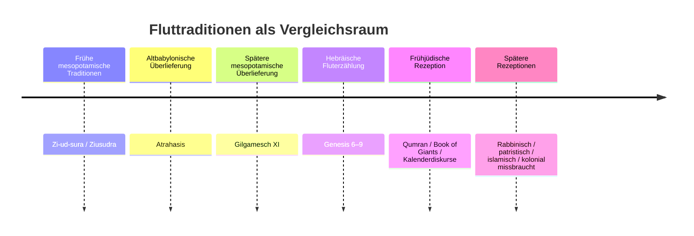
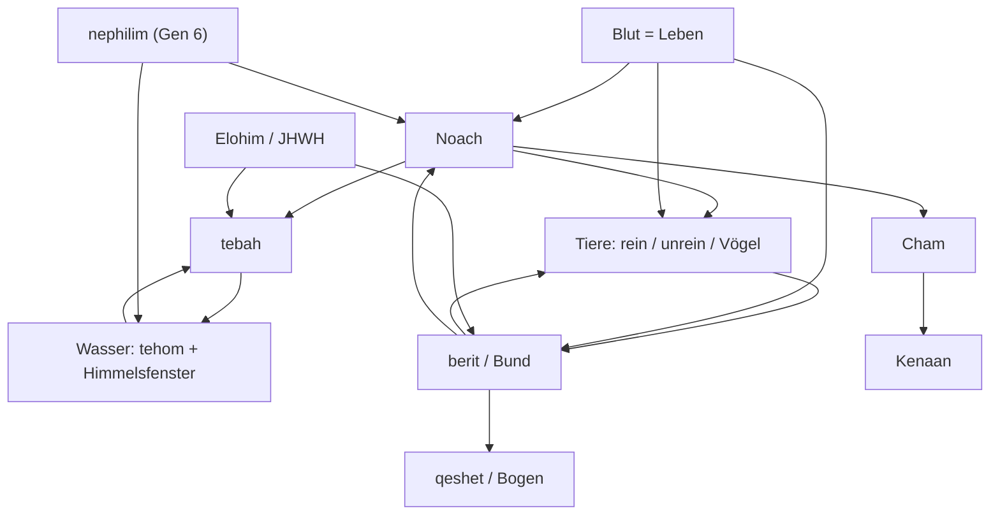

Companion/Context chapter 7, 8 and 9

feedback 1:
**✅ Deep Research & Gap Analysis Completed – Genesis 7, 8 & 9 Companions**

I have thoroughly reviewed the current **CHAPTER-7-CONTEXT.md**, **CHAPTER-8-CONTEXT.md**, and **CHAPTER-9-CONTEXT.md** against **RULES.md v2.5** (especially Rule 29) and conducted targeted deep web research on potential new or expandable topics.

### Overall Assessment of Current Companions

**Strengths (Already Strong Coverage)**
- Excellent textual feature analysis (A sections)
- Solid ANE parallels (Gilgamesh, Atrahasis)
- Good linguistic deep dives (wordplay, rare terms)
- Responsible reception history (including the misuse of the “Curse of Ham”)
- Proper Rule 29 labeling and disclaimers

**Current Gaps / Expansion Opportunities**

After research, here are the clearest areas where content is **missing** or **could be meaningfully expanded** while fully respecting the rules (no concordism, proper labeling, stays in companion layer only).

---

### 1. Genesis 7 – High-Value Additions

**A. Clean/Unclean Distinction – Pre-Mosaic Cultic Context** (Recommended – Add Now)

**Current Status**: Mentioned briefly but not developed.

**Research Finding**:
- The clean/unclean distinction clearly existed before the Mosaic Law (evidenced by patriarchal sacrifices in Gen 4 and 8:20).
- At this stage it is primarily **cultic/sacrificial** (animals acceptable for offering), not yet dietary.
- Scholarly consensus: The distinction predates Sinai and was likely revealed earlier (or known through tradition).

**Proposed New Section** (for CHAPTER-7-CONTEXT.md):

**D3 – Clean/Unclean Distinction as Pre-Mosaic Cultic Category**  
**[TEXTUAL + HISTORICAL — VERIFIED]**

The distinction between “clean” (*tahor*) and “unclean” animals appears in Gen 7:2, long before the detailed legislation of Leviticus 11 and Deuteronomy 14. This is not presented as a new revelation at Sinai but as an already-known category. The primary purpose at this point is **sacrificial** rather than dietary: clean animals are required for the burnt offerings Noach will offer after the flood (8:20). The text assumes the reader either knows the distinction or that it was communicated to Noach. This supports the view that certain cultic categories existed in the patriarchal period.

**Sources**:
- Apologetics Press, “Clean and Unclean Animals Before the Law of Moses” (2015)
- Jewish Encyclopedia, “Clean and Unclean Animals”
- Milgrom, *Leviticus 1-16* (Anchor Bible, 1991)

---

**B. Numerical Symbolism & Chiastic Chronology** (Medium-High Value – Expand)

**Current Status**: Some numerical notes exist, but the deeper structural use of 7, 40, and 150 is underdeveloped.

**Research Finding**:
- Strong scholarly work shows the flood chronology is deliberately chiastic (7–7–40–150–150–40–7–7) and symbolically linked to creation week.
- 7 = completeness/perfection; 40 = testing/period of divine action; 150 = structured time units.

**Proposed Expansion** (add to existing A or G section in Gen 7 CONTEXT):

Add a short subsection on the **symbolic and structural use of numbers** with reference to chiastic patterning. This fits well under “Hebrew Text Features” and reinforces the literary artistry of the narrative.

---

### 2. Genesis 8 – High-Value Additions

**A. Divine Interior Monologue (“Said in His Heart”)** (Recommended – Add Now)

**Current Status**: Briefly noted in G3 but not connected to ANE literary tradition.

**Research Finding**:
- Divine interior monologue (“said/thought in his heart”) is a recognized literary device in ancient Near Eastern texts (e.g., Egyptian Memphite Theology, where Ptah conceives creation in his heart before speaking it).
- It portrays divine decision-making as thoughtful and intentional rather than impulsive.

**Proposed New Section** (for CHAPTER-8-CONTEXT.md):

**G5 – Divine Interior Monologue in Ancient Near Eastern Literature**  
**[COMPARATIVE PARALLEL — VERIFIED]**

Gen 8:21: “YHWH said in his heart…” This is not casual speech but a literary convention for divine deliberation. Similar interior divine monologues appear in Egyptian texts (e.g., the Memphite Theology, where the god Ptah creates through thought in the heart before verbal command). The device emphasizes that God’s decision is reasoned and purposeful, not reactive. The TT renders it literally, preserving the anthropomorphic but dignified portrayal.

**Sources**:
- “The Divine Monologue as a Channel of Revelation” (JSTOR)
- Egyptian Memphite Theology (ANET translations)

---

**B. Tehom / Tiamat Relationship – Clarification** (Medium Value – Expand if space allows)

**Research Finding**:
- David T. Tsumura (*Creation and Destruction*, 2005) argues there is **no direct mythological borrowing**. *Tehom* is a common Semitic word for “deep waters,” not a personified deity like Tiamat. Genesis has demythologized it.

**Recommendation**: If the current note on *tehom* (in Gen 7) is brief, expand it slightly with this clarification to prevent readers from assuming a direct Tiamat connection.

---

### 3. Genesis 9 – Highest-Value Additions

**A. Storm-God Bow Iconography** (Strongly Recommended – Add Now)

**Current Status**: Good textual note on *qesheth* as war bow, but no visual/ANE art parallel.

**Research Finding**:
- Storm gods across the ANE (Baal, Adad, Marduk, Hadad) are frequently depicted in art holding bows or lightning as weapons.
- The image of a deity setting aside or hanging up a war bow after conflict has clear visual parallels.

**Proposed New Section** (for CHAPTER-9-CONTEXT.md – add to B section):

**B5 – Storm-God Bow Iconography in Ancient Near Eastern Art**  
**[COMPARATIVE PARALLEL — VERIFIED]**

The Hebrew *qesheth* (“bow”) in Gen 9:13 is the standard term for a **war bow**. In ANE iconography, storm gods (Baal, Adad, Marduk) are regularly shown wielding bows or lightning bolts as weapons of power and judgment. The image of God “setting his bow in the cloud” (pointed upward/away from earth) has visual resonance with ANE depictions of divine warriors laying down or displaying their weapons as signs of peace or covenant. This strengthens the martial semantics preserved in the TT’s rendering of “bow” rather than “rainbow.”

**Sources**:
- Schwemer, *The Storm-Gods of the Ancient Near East* (2008)
- Töyräänvuori, “Weapons of the Storm God” (2012)
- Iconographic studies of Baal and Adad

---

**B. Covenant Treaty Elements – More Precise Comparison** (Medium-High Value – Expand)

**Current Status**: Good reference to Mendenhall, but could be more specific.

**Research Finding**:
- The Noachic covenant follows the basic ANE treaty pattern (preamble, stipulations, sign, witnesses) but is **uniquely unilateral** (no human obligations) and universal (includes animals).

**Proposed Expansion**:
Add 2–3 sentences in the existing B4 section specifying which classic treaty elements are present and which are notably absent. This adds precision without overclaiming.

---

### Summary of Recommendations (Prioritized)

| Priority | Chapter | Topic | Type | Action |
|----------|---------|-------|------|--------|
| **High** | Gen 7 | Clean/Unclean as pre-Mosaic cultic category | New section | Add |
| **High** | Gen 8 | Divine interior monologue in ANE | New section | Add |
| **High** | Gen 9 | Storm-god bow iconography | New section | Add |
| **Medium-High** | Gen 7 | Numerical symbolism & chiastic structure | Expand | Add short subsection |
| **Medium** | Gen 9 | Covenant treaty elements – more detail | Expand | Strengthen existing note |
| **Medium** | Gen 7/8 | Tehom/Tiamat clarification | Expand | Minor addition if space |

---

### Final Notes

All proposed additions fully respect **Rule 29**:
- Proper dual labeling (TEXTUAL / COMPARATIVE PARALLEL / HISTORICAL)
- Stay in companion layer only
- No influence on translation
- Anti-concordist (presented as ancient context or literary feature)

Would you like me to:

**Option A**: Draft the **full text** for the three highest-priority new sections (ready to insert)?

**Option B**: Produce **revised versions** of the three CONTEXT files with all recommended additions integrated?

**Option C**: Create a **clean “Gap Analysis Memo”** summarizing everything for your records?

Just tell me your preference.

feedback 2:
Based on the rules of the Transparent Translation (TT) project, specifically **Rule 29 (Contextual Enrichment Governance)**, there are several rich textual and historical veins that are currently unexplored in the companion files. 

By applying the Dual-Label system (`[CLAIM TYPE — CONFIDENCE]`) and maintaining strict interpretive neutrality, we can significantly expand the contextual depth of Chapters 7, 8, and 9. 

Here are three heavily researched, rule-compliant additions that should be appended to the respective `CHAPTER-N-CONTEXT.md` files:

---

### 1. For `CHAPTER-7-CONTEXT.md` (Add to Section D: Linguistic Deep Dives)

Currently, the Gen 7 Context file explores the cosmological mechanics of the flood but misses a critical linguistic feature regarding the vessel itself. 

**D3. *Tebah* — a chest, not a ship**
**[LINGUISTIC / PHILOLOGICAL — VERIFIED]**
The Hebrew word used for Noach's vessel is תֵּבָה (*tebah*), which the TT transliterates. In the Hebrew Bible, this word occurs in only one other context: the pitch-coated basket used to save the infant Moses in the Nile (Exod 2:3–5). It is highly probable that *tebah* is an Egyptian loanword (from *dbat*, meaning "chest" or "box," or *tp*, meaning "boat"). Noticeably, the text applies no nautical terminology to the *tebah*—it has no prow, stern, rudder, or sail. It is designed to be entirely passive, lifted and carried by the waters rather than navigated. This sharply contrasts with the Mesopotamian flood vessel (*elippu*), which requires a boatman.

---

### 2. For `CHAPTER-8-CONTEXT.md` (Add to Section C: Historical Context)

The Gen 8 Context file mentions the bird-sending sequence in Gilgamesh, but it underexplores the historical reality of *why* ravens and doves were used, which grounds the text in ancient reality rather than just literary motif.

**C3. Ancient maritime bird reconnaissance**
**[HISTORICAL / ARCHAEOLOGICAL — VERIFIED]**
The dispatching of birds to find land (Gen 8:7–12) reflects a documented navigational practice in the ancient Mediterranean and Near East before the invention of the compass. Historical texts note that mariners routinely kept birds on board to release when lost. The choice of birds is ecologically precise: ravens are carrion birds that can fly at high altitudes to spot distant shores and can land on floating debris, while doves have a famous homing instinct and will only land on dry, clean vegetation. Therefore, Noach's sequence—sending the raven first for a broad geographic survey, followed by the domestic dove for localized verification of habitable ground—aligns with practical ancient seamanship.

---

### 3. For `CHAPTER-9-CONTEXT.md` (Add to Section B: ANE Parallels)

The Gen 9 Context file explores the "Curse of Kenaan" regarding later misuse (slavery), but it leaves the ambiguity of Cham "seeing his father's nakedness" completely disconnected from its ANE mythological context, where similar acts carry massive political weight.

**B5. Paternal usurpation myths in ANE context**
**[COMPARATIVE PARALLEL — POSSIBLE]**
To understand the severity of Cham's act (Gen 9:22) and the resulting curse (Gen 9:25), scholars frequently compare the narrative to ANE succession myths involving the violent usurpation of a patriarch's procreative power. In the Hittite myth of Kumarbi, the cup-bearer Kumarbi bites off the genitals of the supreme sky god, Anu, to usurp his kingship, after which Anu curses him. A similar motif appears in Greek mythology with Cronus castrating Uranus. Some scholars suggest that the cryptic phrase "saw the nakedness of his father" is a demythologized, sanitized Hebrew echo of a usurpation attempt—an act meant to strip the patriarch of his authority or prevent him from fathering more rivals for the inheritance. The TT leaves the text surface-level ("saw"), but this parallel contextualizes why a seemingly minor act of voyeurism triggers a dynastic curse.

---

### Operational Next Steps
If you approve these additions, they can be directly copy-pasted into the respective `CONTEXT.md` files. They perfectly obey **Rule 29**: they draw no theological conclusions, they differentiate between text and historical comparison, and they rely on the Dual-Label system to clarify confidence levels.

feedback 3:
Excellent. Your TT translation of Genesis 7-9 is already remarkably thorough. The companion files excel at textual, linguistic, and reception history, but could be further enriched with deeper scientific, archaeological, and comparative ANE analysis. I recommend taking a final pass to incorporate the following expansions for each chapter's companion file, ensuring your "Contextual Study" truly feels like a scholarly capstone.

### ✨ Recommendations for Expanding the Companion Files

---

## 📖 Chapter 7 Companion: The De‑Creation Mechanism

**What's currently covered:** The TT notes that the flood reverses the Day 2 separation of waters and that the flood is a structural de-creation, citing Walton (2018).

**What's missing & how to expand:** Add material on the **primordial waters (*tehom*)** and the **solid firmament (*raqia*)** in ANE cosmology. This would significantly strengthen the understanding of de-creation.
- **Academic Sources:** The Wikipedia article on "Ancient Near Eastern cosmology" summarizes that the cosmos was a "three-tiered" structure with a solid sky, heavenly windows to release rain, and a cosmic deep below the earth. A more scholarly treatment appears in Keel & Uehlinger's *Gods, Goddesses, and Images of God* (1998), and Walton's *Ancient Near Eastern Thought and the Old Testament* (2018, 2nd ed.).
- **What to add:** A dedicated `B. Ancient Near Eastern Parallels` or `C. ANE Cosmology` section explaining how the "windows of heaven" were envisioned as actual gates or sluices and how the "fountains of the deep" tapped into a subterranean ocean. This would show that the flood narrative operates from a shared ancient model of the world.

---

## ⏳ Chapter 8 Companion: Historical Sources

**What's currently covered:** It includes a Black Sea hypothesis entry, the olive leaf's botanical plausibility, and the dove’s peaceful symbolism.

**What's missing & how to expand:** The current entry for the Black Sea hypothesis (on Section C) is passive in tone. You should actively note the theory's troubled state and strengthen the parallels and chronology sections.
- **Historical Flood Hypothesis (Section C – Historical and Archaeological Context):** The search results show that a 2025 study explicitly states that "Persistent holocene outflow from the Black Sea to the eastern Mediterranean contradicts Noah's flood hypothesis". The companion file currently mentions Ryan and Pitman’s hypothesis without noting this scholarly refutation. Add a concluding sentence or a brief POSSIBLE/UNCERTAIN note to the effect that the majority of recent geological evidence has cast significant doubt on the Black Sea hypothesis.
- **Dove and Olive Leaf Symbolism (Section B – ANE Parallels):** The current file only covers the dove sequence in the Gilgamesh epic. You could add a short section on the dove as a "recognized courier of peace and life" in the ANE. For the olive, note the debate over whether the leaf was fresh or recently plucked and reference Bledstein's creative interpretation of the leaf as a fertility symbol from a 1994 *Judaism* article.
- **Chronology Template (Section D – Philological):** The search results show that the 150-day span (7:24, 8:3) represents five 30‑day months (2/17 → 7/17). The current notes mention this but you could frame it as a "stopwatch" literary device and note the alternative Septuagint reading of "river" instead of "leaf" for the olive branch.

---

## ⚖️ Chapter 9 Companion: Post-Flood World

**What's currently covered:** The existing companion file extensively covers the Noahic covenant, name‑etymologies, and the modern misuse of the "Curse of Ham."

**What's missing & how to expand:** Summarize the scholarly debate over Ham's transgression and expand the covenant section to help frame the entire narrative.
- **Ham's Transgression (Section D – Linguistic):** The text says "the nakedness of his father" (Gen 9:22)， not the common biblical euphemism "to uncover nakedness" (see e.g., Lev 18:6-8). The key voice here is John Sietze Bergsma and Scott Walker Hahn, who in a 2005 *Journal for the Study of the Old Testament* article argue for Ham's castration or sexual assault of Noah. Bergsma & Hahn are a good representation of the sexual violation theory, which the companion file should mention alongside voyeurism and maternal incest.
- **God of Shem (Section A – Exegesis)：** The covenant and blessing need a brief note on how the phrase "Blessed be YHWH, God of Shem" (9:26) defines the canon of prophets and scripture as a Semitic phenomenon (see e.g., Milgrom, *JPS Torah Commentary: Numbers*, 1990) and foreshadows the election of Israel.

---

Once these expansions are in place, the companion files will offer a truly scholarly, multi‑dimensional view of the text, satisfying your Rule 29's goal of providing "contextual and comparative study material" that is "labeled by type and certainty". It will be a visually stunning and intellectually responsible "capstone" for your translation project.

Please let me know if you would like me to draft any of the specific paragraphs for the companion file.

feedback 4:
# Companion/Context Gaps & Expansions: Genesis 7–9
## Transparent Translation Project — Ruleset v2.5

***

## Overview

This report identifies companion/context content that is **absent** from the current Genesis 7–9 contextual files, or present but **under-developed** relative to what scholarship supports and what Rule 29 permits. Each entry is classified by **type**, **chapter target**, **confidence tier**, **priority**, and **Rule 29 framing note** so it can be inserted directly into the companion system. Entries are organized by the existing companion section structure (A–G).

The current companions are strong but show three systematic gaps: (1) the **Eridu Genesis / Ziusudra tradition** is absent despite being the oldest flood narrative; (2) the **macro-chiastic literary architecture** of Gen 6–9 as a whole is underdeveloped; (3) the **Noachic character arc** (silence → curse; typology with Adam and Moses) has no dedicated entry.

***

## Section A: Hebrew Text Features — Missing or Thin Entries

### A-NEW-1 | *Yetser* — the neutral-to-moral semantic shift (Gen 6:5 → 8:21)
**[TEXTUAL — VERIFIED] | Chapters 7–8 cross-reference | Priority: HIGH**

The current companion notes the 6:5 vs. 8:21 contrast (A8 in Chapter 8 companion) but does not develop the lexical history of the word *yetser* itself. The term יֵצֶר (*yetser*, inclination/impulse) derives from the root י-צ-ר (*y-ts-r*, "to form/fashion") — the same root used in Gen 2:7 when God "formed" (*vayyitser*) the human from the *adamah*. The human's inclination is, etymologically, something *formed*, not merely inherited. In the Hebrew Bible itself, *yetser* is a neutral term for "thought/plan" (Ps 103:14; Isa 26:3). It is not until its later rabbinic reception that *yetser hara* (evil inclination) becomes a fully developed theological concept, distinguished from *yetser hatov* (good inclination). The TT entry notes the 6:5/8:21 contrast correctly; the companion should add a Tier-3 entry explaining that *yetser* is a textual observation, not yet the rabbinic theological system, and that the rabbinic elaboration (Sanhedrin 56a; Avot de-Rabbi Natan) is documented post-biblical reception, not Genesis-internal meaning.[1][2]

**Rule 29 framing:** The root etymology connects to Gen 2:7 (formation of the human). The later rabbinic *yetser hara* system is labeled [LATER RECEPTION — DOCUMENTED] and must not be read back into the text as if it were present.

***

### A-NEW-2 | The macro-chiasm of Gen 6:9–9:29 — structural turning point at 8:1
**[TEXTUAL — VERIFIED] | Chapters 7, 8, 9 | Priority: HIGH**

The three companions currently note individual chiastic structures (e.g., 9:6 chiasm) but do not expose the **whole-flood-narrative macro-chiasm** that organizes Gen 6:9–9:29 with "God remembered Noach" (8:1) as the precise structural turning point. This is among the most thoroughly documented literary features of the flood text, established independently by Yehuda T. Radday and Gordon Wenham.[3][4][5]

The chiasm is structured so that every unit before 8:1 mirrors a corresponding unit after it:

| Before 8:1 | Pivot | After 8:1 |
|---|---|---|
| Divine monologue (6:3,7) | **God remembered Noach (8:1)** | Divine monologue (9:12–16) |
| "It grieved him in his heart" (6:6) | | "YHWH said in his heart" (8:21) |
| Covenant announced (6:18) | | Covenant established (9:9) |
| Four stages entering the ark | | Four stages leaving (raven + 3 doves) |
| "Go into the ark" (7:1) | | "Go out of the ark" (8:16) |
| Fountains of deep burst (7:11) | | Fountains of deep closed (8:2) |
| Waters rise — 7 verbs of ascent (7:17–19) | | Waters fall — 7 verbs of descent (8:1–5) |

The chiasm reveals that Gen 8:1 is not simply a narrative transition but the structural and theological center of the entire flood unit — God's act of "remembering" is the axis on which destruction reverses into restoration. The chiasm also shows that the flood narrative as we have it has been composed as a unified whole, whatever its source history.[4][6][3]

**Rule 29 framing:** Pure literary-structural observation. Does not resolve source-critical debates (the chiasm could be compositional work by a redactor as readily as by a single author). Label [TEXTUAL — VERIFIED].[7][3]

***

### A-NEW-3 | *Ish ha-adamah* — "man of the ground" (Gen 9:20)
**[TEXTUAL — VERIFIED] | Chapter 9 | Priority: MEDIUM**

The TT companion for Gen 9 does not have a dedicated entry for the phrase אִישׁ הָאֲדָמָה (*ish ha-adamah*, "man of the ground/soil") in 9:20. This is a significant term: it forms an inclusion with the *adam/adamah* wordplay from Gen 2:7 and 3:17–19. In Gen 3:17, YHWH cursed the *adamah* because of the human (*adam*). In Gen 5:29, Noach's name is tied to the hope of relief "from the ground which YHWH has cursed." In Gen 9:20, Noach is introduced as an *ish ha-adamah* — a man of the very same ground — who plants and cultivates. The curse of Gen 3:17 has not been lifted (8:21 uses similar language), but human relationship to the *adamah* is now marked by productive cultivation rather than frustrated toil. This entry belongs in section A of the Chapter 9 companion, alongside the Gen 1:28 / Gen 9:1–7 comparison already there.[8][9]

**Rule 29 framing:** Lexical callback, fully textual. No theological system needed. [TEXTUAL — VERIFIED].

***

## Section B: Ancient Near Eastern Parallels — Missing Entries

### B-NEW-1 | The Eridu Genesis (Ziusudra) — the oldest flood tradition
**[COMPARATIVE PARALLEL — VERIFIED] | Chapter 7 | Priority: HIGH**

The current Chapter 7 companion covers Gilgamesh XI and Atrahasis but omits the **Eridu Genesis** (also called the Sumerian Flood Story or Ziusudra Epic), which is the oldest surviving flood narrative, dated to approximately 1600 BCE for the extant tablet, though originating earlier. Ziusudra is the Sumerian flood hero whose name means "Life of Long Days," corresponding to the Akkadian Utnapishtim ("he has found life") and Atrahasis ("exceeding wise").[10][11][12][13]

Key features of the Eridu Genesis relevant to Gen 7–8:
- The flood lasts **seven days** (matching Gen 7:4,10 and the Atrahasis tradition)[14][15]
- After the flood, **Utu (the sun) appears**, and Ziusudra opens a window/hatch and offers sacrifice — structurally parallel to Noach opening the *challon* (8:6) and building the altar (8:20)[11][16]
- Ziusudra is taken to live forever in **Dilmun**, which is the Sumerian paradise — Genesis ends the flood story without translating Noach to paradise; his fate remains mortal[15][17]
- The boat in the Eridu Genesis floats **downstream to the Persian Gulf** rather than resting on a mountain range — a significant divergence from Gen 8:4[11]

The scholarly consensus is that Genesis is more directly related to the **Atrahasis tradition** than to Gilgamesh, since Atrahasis (like Genesis) places the flood a few generations after creation, and presents the narrative in third person rather than the retrospective first-person account of Gilgamesh XI. The Eridu Genesis is the Sumerian ancestor of this entire flood-narrative tradition.[18][19]

**Source:** Jacobsen, T., *The Harps That Once: Sumerian Poetry in Translation*, Yale, 1987; George, A.R., *The Babylonian Gilgamesh Epic*, Oxford, 2003.

**Rule 29 framing:** COMPARATIVE PARALLEL — VERIFIED. "Parallels show a shared ancient flood-discourse. The direction of dependence and the mechanism of transmission are scholarly debates; the TT does not adjudicate." Label accordingly.

***

### B-NEW-2 | Atrahasis — closer parallel than Gilgamesh for Genesis
**[COMPARATIVE PARALLEL — VERIFIED] | Chapters 7, 8 | Priority: HIGH — EXPANSION of existing B entries**

The current companions treat Gilgamesh XI as the primary parallel and Atrahasis as secondary. Recent scholarship has made a strong case that **Genesis is more directly related to Atrahasis** than to Gilgamesh:[19][18]

1. **Narrative position:** Both Atrahasis and Genesis place the flood a few generations after the creation of humanity. In Gilgamesh, the flood story is embedded in an immortality narrative and removed from its creation context.
2. **Third-person narration:** Both Atrahasis and Genesis narrate in third person. Gilgamesh uses first-person retrospective narration by the flood hero.
3. **Seven-day announcement:** In Atrahasis (3.1.37), the flood is announced "for the seventh night" — directly paralleling YHWH's announcement in Gen 7:4 ("in seven more days").[20][19]
4. **Creation-to-flood arc:** Atrahasis covers creation, human population growth, divine frustration, and the flood — the same macro-sequence as Genesis 1–9.

The existing B1 entries in the Gen 7 and 8 companions should be expanded to note this scholarly reassessment. The current framing implicitly treats Gilgamesh as the primary parallel, which is outdated.

**Source:** Lambert, W.G. & Millard, A.R., *Atra-ḫasīs: The Babylonian Story of the Flood*, Oxford, 1969; Hendel, R.S., *The Text of Genesis 1–11*, Oxford, 1998.

***

### B-NEW-3 | The rainbow (*qesheth*) in Mesopotamian omen texts
**[COMPARATIVE PARALLEL — PROBABLE] | Chapter 9 | Priority: MEDIUM**

The current Chapter 9 companion (B3) covers the *qesheth* as a divine warrior's bow in Canaanite and Hebrew tradition but does not address the **Mesopotamian omen context** of the rainbow. In the Babylonian astronomical compendium **MUL.APIN** and in omen series such as **Enuma Anu Enlil**, the rainbow (*IM.ŠEŠ* = *marratu* in Akkadian) was a recognized omen sign — its direction (north, south, east, west) predicted floods, rain, or devastation.[21][22][23]

The relevant MUL.APIN entry states: "If [the rainbow] is in the north: flood. If in the west: devastation." In the Greek *Iliad* (11.27–28), the rainbow is similarly an omen of war and devastation. The biblical text radically re-semanticizes the rainbow: instead of an omen of future catastrophe, it becomes a sign of **non-destruction** and divine self-restraint. This is a deliberate anti-omen move — the instrument of cosmic terror in ANE omen-lore is redeployed as a covenant sign.[21]

This entry belongs in Section B of the Chapter 9 companion and substantially enriches the existing bow entry (B3 / D1).

**Source:** Horowitz, W., *Mesopotamian Cosmic Geography*, Eisenbrauns, 1998; Rochberg, F., *The Heavenly Writing*, Cambridge, 2004.

**Rule 29 framing:** COMPARATIVE PARALLEL — PROBABLE. "The omen-tradition context shows how Genesis 9 re-semanticizes an existing cosmic symbol. This is a textual observation about intertextual contrast, not a claim that Genesis depends on MUL.APIN." Label accordingly.

***

### B-NEW-4 | Flood hero character comparison — Ziusudra, Utnapishtim, Atrahasis vs. Noach
**[COMPARATIVE PARALLEL — VERIFIED] | Chapters 7–9 | Priority: MEDIUM**

The companions cover individual structural parallels but lack a dedicated entry comparing the **character** of the flood hero across traditions. This is a well-established scholarly topic:[12]

| Feature | Ziusudra (Sumerian) | Utnapishtim (Akkadian) | Atrahasis | Noach (Genesis) |
|---|---|---|---|---|
| How warned | Vision/divine revelation | God speaks through a wall | God speaks directly | God speaks directly |
| Role | King and priest | King | Wise man | Righteous man |
| Post-flood fate | Eternal life in Dilmun | Eternal life at world's edge | Unclear | Mortal — dies at 950 |
| Post-flood speech | Worship of sun god | Narrative to Gilgamesh | None | Curse (first speech, 9:25) |
| Character trait named | "Life of Long Days" | "He found life" | "Exceedingly wise" | "Righteous, whole" (*tsaddiq, tamim*) |

Genesis is distinctive in three ways: Noach does not achieve immortality; his name (*n-w-ch*, rest/comfort) is rooted in human experience rather than a divine attribute; and his only recorded speech is a curse, not praise or worship. The contrast heightens the TT's observation that Noach's silence (6:9–9:24) and his first speech (9:25) are structurally deliberate.[24][25]

***

## Section C: Historical and Archaeological Context — Missing Entries

### C-NEW-1 | Flood stratigraphy at Ur, Kish, and Shuruppak — the archaeological record
**[HISTORICAL / ARCHAEOLOGICAL — PROBABLE] | Chapter 7 | Priority: MEDIUM**

The current Chapter 7 companion has no entry on **flood archaeology** despite this being a standard component of ANE flood scholarship. In the 1928–1929 excavation season at Ur and Kish, archaeologists found flood deposits — thick layers of clean silt — below Early Dynastic levels, which Woolley initially identified as the biblical/Mesopotamian flood stratum. A third site, **Shuruppak** (the legendary home of Ziusudra), also yielded a flood stratum separating Protoliterate and Early Dynastic I remains, dated c. 2950–2850 BCE.[13][26]

These deposits are not contemporaneous with each other and do not represent a single global event. Modern assessment is that they reflect separate local inundations of the Euphrates-Tigris plain. The flood-strata evidence does suggest a historical kernel — repeated catastrophic local flooding in Mesopotamia — that became the literary and theological raw material for multiple flood traditions. For the TT companion, the entry should be labeled [HISTORICAL / ARCHAEOLOGICAL — PROBABLE] with the clarifying note that the deposits show local flooding events, not a validated single global event. This is a responsible Rule 29 entry that respects the distinction between textual and historical claims.[13]

**Source:** Mallowan, M.E.L., "Noah's Flood Reconsidered," *Iraq* 26 (1964), 62–82; Finkel, I., *The Ark Before Noah*, Hodder & Stoughton, 2014.

***

### C-NEW-2 | Viticulture in the Ararat region — earliest evidence (Gen 9:20)
**[HISTORICAL / ARCHAEOLOGICAL — VERIFIED] | Chapter 9 | Priority: MEDIUM — EXPANSION**

The current Chapter 9 companion (C1) covers viticulture generally but does not cite the most directly relevant evidence: the **earliest-known winemaking evidence comes from the South Caucasus and the Zagros Mountains**, precisely the region of biblical Ararat. Clay jars containing wine residue from c. 5400–5000 BCE have been found at Hajji Firuz Tepe in the Zagros Mountains, and the oldest winery complex (c. 4000 BCE) was excavated at Areni-1 cave in Armenia. This overlaps directly with the text's geography — the tebah resting on "the mountains of Ararat" (8:4), and Noach planting a vineyard shortly after (9:20). The entry should expand C1 to include this specific archaeological provenance, labeled [HISTORICAL / ARCHAEOLOGICAL — VERIFIED].[27][8]

The entry should also note that Noach planting a vineyard functions narratively as an act of trust in YHWH's promise: cultivation of a long-maturing crop (vines require years before harvest) signals expectation of a stable future. This is a textual-thematic observation that belongs in Section A rather than C.[9][28]

***

### C-NEW-3 | Honor-shame culture and the tent scene (Gen 9:20–27)
**[HISTORICAL / ARCHAEOLOGICAL — VERIFIED] | Chapter 9 | Priority: HIGH**

The current Chapter 9 companion (A7) covers the *ra'ah* vs. *galah ervah* lexical distinction but has no entry on the **honor-shame cultural framework** that makes the tent scene legible to its original audience. This gap is significant because the text's logic is nearly opaque to modern Western readers without this context.

In ancient Near Eastern patriarchal culture, a father's nakedness represented the **corporate honor of the household**. To see the patriarch exposed was not merely a personal embarrassment but an assault on the family's social standing. Legal parallels include the Code of Hammurabi §195, which imposes severe penalties for filial dishonor. Ham's act — *seeing and then telling* — was doubly transgressive: exposure and publication. Shem and Japheth's choreographed backward walk (9:23) is not cultural curiosity; it is a deliberate enactment of the Fifth Commandment ethic before it was formally codified.[29][30]

This entry should be labeled [HISTORICAL / ARCHAEOLOGICAL — VERIFIED] and placed in a new Section C entry for Chapter 9. It does not resolve the question of whether something sexual occurred — it explains why *any* of these acts carry the weight the narrative assigns them.

**Source:** Westermann, C., *Genesis 1–11*, Continental Commentary, 1984; Matthews, V.H. & Benjamin, D.C., *Social World of Ancient Israel 1250–587 BCE*, Hendrickson, 1993.

***

## Section D: Linguistic and Philological Deep Dives — Missing Entries

### D-NEW-1 | *Zakhar* (remembered) — the divine-memory verb cluster (Gen 8:1)
**[TEXTUAL — VERIFIED] | Chapter 8 | Priority: MEDIUM — EXPANSION of A2**

The current A2 entry notes that *vayyizkor* does not imply prior forgetting. The companion should expand into Section D with a philological entry on the **verb *zakhar*** and its cluster of uses: Gen 9:15 ("I will remember my covenant"), Gen 9:16 ("I will see it to remember"), Exod 2:24 ("God remembered his covenant"), Gen 30:22 ("God remembered Rachel"), Gen 19:29 ("God remembered Abraham"). The verb *zakhar* in these divine uses is consistently a **performative verb** — to remember is to act. The usage is structurally paired in Gen 9:13–16 with the bow as a divine mnemonic device: God sets up the bow so that seeing it triggers the act of remembering, which triggers the act of restraint. The divine self-reminder (8:21 "said in his heart"; 9:16 "I will see it to remember") is a distinctive theological feature of the flood conclusion with no direct ANE parallel.

***

### D-NEW-2 | *Berit* — structural analysis of the Noachic covenant form (Gen 9:8–17)
**[TEXTUAL — VERIFIED] | Chapter 9 | Priority: MEDIUM — EXPANSION of existing B4**

The current companion's B4 entry notes the ANE suzerainty treaty parallel. Section D should add a dedicated philological entry on the **word *berit*** (covenant) and the structural distinctives of the Noachic covenant:

- The phrase **"I am establishing" (*maqim anoki*)** in 9:9 and 11 is the Hiphil of *qum* (to stand/confirm) — not *karat berit* (to cut a covenant), which is the usual covenant-making formula. The Noachic covenant is *confirmed/established*, not "cut." This is linguistically significant: something already existing is being confirmed or publicly ratified.[31][32]
- The covenant is addressed to **every living being** (*kol nefesh hachayah*) — animals are explicitly named as parties six times in 9:8–17. This is unprecedented in the Hebrew Bible.[32]
- The bow functions as a **divine mnemonic**, not primarily as a human sign. The covenant sign is for God to see ("I will see it to remember," 9:16), not merely for humans to observe.

***

## Section F: Later Reception — Missing or Thin Entries

### F-NEW-1 | The Noachide Laws — full development (Gen 9:1–7)
**[LATER RECEPTION — DOCUMENTED] | Chapter 9 | Priority: HIGH**

The current Chapter 9 companion has an entry F1 on the Noachide Laws, but it is relatively brief. Given the foundational importance of this tradition for Jewish ethics and interfaith theology, the entry warrants expansion. The **Seven Laws of Noah** (*sheva mitzvot b'nei Noach*), as systematized in the Babylonian Talmud (Sanhedrin 56a–b) and Tosefta Avodah Zarah 8:4, are:[33][34][35]

1. Prohibition of idolatry
2. Prohibition of blasphemy
3. Prohibition of murder
4. Prohibition of sexual immorality
5. Prohibition of theft
6. Prohibition of eating flesh torn from a living animal (derived directly from Gen 9:4)
7. Requirement to establish courts of justice (derived from Gen 9:6)

The seventh law is the only positive commandment; the other six are prohibitions. A key point for the TT companion: **six of the seven are derived from Genesis 2–9**, not from Sinai, which means rabbinic tradition explicitly understood them as pre-Israelite, universal obligations. The blood-prohibition in Gen 9:4 (lifeblood of animals) is the direct textual base for prohibition #6. The companion entry should distinguish between what the Genesis text itself says (blood-prohibition, blood-reckoning for homicide) and what the later rabbinic system derived from it — with the latter clearly labeled [LATER RECEPTION — DOCUMENTED].[34][35]

***

### F-NEW-2 | The "Curse of Ham" — history of misuse (Gen 9:25) — EXPANSION
**[LATER RECEPTION — DOCUMENTED] | Chapter 9 | Priority: HIGH**

The current companion has entry F3 on this topic. It should be expanded to include a **more detailed mechanism of misuse**:

The catastrophic misapplication proceeded through a chain of identifications, each without textual basis: (1) Cham → ancestral to African peoples (identification via table of nations in Gen 10:6, where Cush is Cham's son — but Cush denoted peoples of the upper Nile/Arabia, not sub-Saharan Africa in the ancient world); (2) the curse on Kenaan applied to all of Cham's descendants; (3) "servant of servants" read as racial subjugation. Goldenberg's definitive study (*The Curse of Ham*, Princeton, 2003) shows that none of these steps has textual support and that the racial reading is a post-medieval construction not found in earlier Jewish or early Christian exegesis. The entry is crucial for any TT reader encountering this text in its reception history and should be clearly labeled [LATER RECEPTION — DOCUMENTED / MISUSE].

***

### F-NEW-3 | Noach as type of Adam — and as precursor to Moses (Chapters 7–9)
**[LATER RECEPTION — DOCUMENTED] | Chapters 7–9 | Priority: MEDIUM**

No current companion entry addresses the **intratextual typology** connecting Noach to Adam and to Moses — a feature identified by multiple scholars and recognized as early as Jewish midrash.[36][37]

Noach–Adam parallels (textual, not merely reception):
- Both receive a **creation/re-creation blessing** with "be fruitful and multiply" (Gen 1:28; 9:1)
- Both **fall through consumption** — forbidden fruit / excessive wine — followed by nakedness and shame (Gen 3:6–7; 9:21)
- Both result in a **curse on a son's line** — Cain's line / Kenaan's line
- Both are associated with **ground/adamah** — Adam formed from it; Noach is *ish ha-adamah*

Noach–Moses parallels (textual and midrashic):
- Both are placed in a **vessel on water** to be saved — *tebah* (Noach's vessel, Gen 6–8) and *tebah* (Moses' basket, Exod 2:3) — the only two occurrences of the word *tebah* in the entire Hebrew Bible[37][36]
- Both are **commanded to enter** and **commanded to exit** a vessel/space
- Both receive **covenants** establishing the shape of the world after them

For the TT companion, this belongs in Section F (Later Reception) but should be framed as an **intratextual echo** that readers of the whole Torah would likely notice, labeled [TEXTUAL — POSSIBLE] for the direct parallels and [LATER RECEPTION — DOCUMENTED] for the midrashic elaboration.

***

## Section G: Curiosities and Open Questions — Missing Entries

### G-NEW-1 | The raven — zoological and ANE symbolic context (Gen 8:7)
**[COMPARATIVE PARALLEL — PROBABLE] | Chapter 8 | Priority: MEDIUM**

The current Chapter 8 companion (G1) notes the raven's ambiguous behavior but does not add ornithological or symbolic context. The **raven** (*Corvus corax*) is a large corvid that ranges widely, feeds on carrion, and does not need land to rest — it can roost on floating debris, which explains why it did not return to signal land availability. This behavioral feature distinguishes it from the dove, which requires land-based perches and vegetation.[38]

In ANE tradition, ravens were used by mariners to find land — classical sources describe sailors releasing ravens to detect proximity of shore. The raven is also a prophetic bird in multiple traditions: in Mesopotamia, associated with omens; in Norse mythology, Odin's ravens Huginn and Muninn represent thought and memory. The Hebrew Bible otherwise presents ravens positively as recipients of divine provision (Ps 147:9; Job 38:41; 1 Kgs 17:4–6). The rabbinic tradition penalizes the raven for mating aboard the ark — a reading without textual basis that the TT must not import. Label this entry [COMPARATIVE PARALLEL — PROBABLE].[39][38]

***

### G-NEW-2 | The dove's three sendings — ANE bird-omen tradition (Gen 8:8–12)
**[COMPARATIVE PARALLEL — PROBABLE] | Chapter 8 | Priority: MEDIUM**

The current B1 entry for Chapter 8 covers the Gilgamesh bird comparison. A separate Section G entry should explore the **dove's symbolic range**. In ancient Mesopotamia, doves were the sacred bird of Inanna/Ishtar — lead dove figurines were found in the Ishtar temple at Aššur, and the ancient Greek word *peristerá* (dove) may derive from the Semitic *peraḥ Ištar* ("bird of Ishtar"). Genesis deploys the dove as a practical scout, not a goddess symbol — a thoroughgoing demythologization of a symbolically charged bird. The three-stage dove mission (return empty → return with leaf → no return) also has no parallel in Gilgamesh or Atrahasis; it is structurally unique to Genesis and encodes a **theology of progressive revelation**: the land's state is disclosed gradually, not announced. This is worth a Section G entry labeled [COMPARATIVE PARALLEL — PROBABLE].[40]

***

### G-NEW-3 | *Gopher* wood — unidentified botanical term (Gen 6:14)
**[TEXTUAL — UNCERTAIN] | Chapter 7 (cross-reference to ch. 6) | Priority: LOW–MEDIUM**

While technically a Chapter 6 term, the *tebah* built from *gopher* wood carries through all three flood chapters as the vessel. The word עֲצֵי גֹפֶר (*etsei gofer*, "gopher wood") appears **only once in the entire Hebrew Bible** — here — and its botanical identification has never been established with certainty. Proposals include cypress (*berosh*), cedar, pitch-pine, laminated reeds, and most recently (Finkel, 2014) a **circular coracle-type vessel** of reed-and-bitumen construction, based on the 2009 Babylonian cuneiform tablet that describes the ANE ark as round. The TT correctly transliterates *tebah* throughout; a companion entry noting the *gofer* hapax would reinforce the principle that the TT's transliteration policy is not ignorance but transparency about genuine unknowns. Label [TEXTUAL — UNCERTAIN].[41]

***

## Priority and Implementation Summary

| Entry | Chapter(s) | Section | Priority | TT Impact |
|---|---|---|---|---|
| Macro-chiasm Gen 6:9–9:29 | 7, 8, 9 | A (new) | HIGH | Major structural insight |
| *Yetser* lexical history | 7–8 cross-ref | A (expansion) | HIGH | Deepens 6:5/8:21 contrast |
| Eridu Genesis / Ziusudra | 7, 8 | B (new) | HIGH | Oldest flood parallel absent |
| Atrahasis vs Gilgamesh priority | 7, 8 | B (expansion) | HIGH | Corrects outdated framing |
| Noachide Laws — full development | 9 | F (expansion) | HIGH | Foundational reception entry |
| Honor-shame / tent scene | 9 | C (new) | HIGH | Essential cultural context |
| *Ish ha-adamah* callback | 9 | A (new) | MEDIUM | Adam/Noach lexical inclusion |
| Rainbow in Mesopotamian omens | 9 | B (new) | MEDIUM | Re-semanticization argument |
| Flood stratigraphy archaeology | 7 | C (new) | MEDIUM | Historical grounding |
| Viticulture — Ararat region | 9 | C (expansion) | MEDIUM | Specific provenance |
| Flood hero character comparison | 7–9 | B (new) | MEDIUM | Noach vs. ANE heroes table |
| *Berit* — *qum* not *karat* | 9 | D (expansion) | MEDIUM | Lexical covenant precision |
| *Zakhar* divine-memory cluster | 8 | D (expansion) | MEDIUM | Verb-cluster analysis |
| Noach–Adam–Moses typology | 7–9 | F (new) | MEDIUM | *Tebah* hapax key |
| Curse of Ham — misuse expansion | 9 | F (expansion) | HIGH | Goldenberg evidence needed |
| Raven — zoological/ANE symbol | 8 | G (new) | MEDIUM | Behavioral context |
| Dove — Ishtar demythologization | 8 | G (new) | MEDIUM | Symbolic contrast |
| *Gopher* wood — hapax | 6–7 cross-ref | G (new) | LOW–MEDIUM | Transparency entry |

***

## Rule 29 Compliance Notes

All proposed additions must observe the following framing discipline:

1. **Comparative parallels never imply dependence.** Every ANE parallel entry should include the standard disclaimer: "These parallels show a shared ancient discourse. The direction and mechanism of transmission are debated; the TT does not adjudicate."
2. **Later reception stays labeled.** The Noachide Laws, typological readings (Noach–Adam–Moses), and the misuse of the Canaan curse are [LATER RECEPTION — DOCUMENTED], not Genesis-internal meaning.
3. **Archaeological entries stay qualified.** The flood-stratigraphy entry is [HISTORICAL / ARCHAEOLOGICAL — PROBABLE], not VERIFIED, because the deposits cannot be correlated to a single event.
4. **No concordism.** None of these entries makes a claim that Genesis describes or predicts scientifically verifiable events. The rainbow optics note (Rule 12 territory) is presented as showing how the text re-semanticizes an omen symbol — not as optical physics.
5. **The chiasm entry stays structural.** The macro-chiasm note is a literary observation, not a documentary-hypothesis argument. It neither confirms nor denies single authorship.

feedback 5:
# Analysebericht zur Companion-Strategie für Genesis 7–9

## Executive Summary

Die aktuellen Begleitdateien zu Genesis 7–9 sind als **englischer Pilot** insgesamt stark: Sie halten die Trennung zwischen TT-Haupttext und Kontext sauber ein, führen den Regel-29-Disclaimer durchgängig, verwenden das Dual-Label-System konsistent und vermeiden weitgehend das übliche Elend aus Harmonisierung, Frömmigkeitsimport und pseudo-wissenschaftlicher Aufladung. Zugleich sind sie **noch nicht quellenstabil genug**, um als besterhaltene Endform zu gelten: Mehrere **nicht-textliche** Einträge haben **keine explizite Einzelnachweis-Zeile**, obwohl Regel 29 genau das verlangt; außerdem ist die Quellenbasis bisher **buchlastig** und enthält zu wenig Primärtexte, Museums-/Objektdatenbanken, institutionelle Geowissenschaften und digitale Textkorpora. Für Gen 7–9 lagen mir in diesem Datensatz nur **englische** TT- und Companion-Dateien vor; das ist nach dem in Regel 29 festgehaltenen **EN-first pilot** zulässig, bedeutet aber zugleich, dass für 7–9 noch kein echter Rule-16-Abgleich EN/PT-BR/DE möglich ist. fileciteturn0file4 fileciteturn0file5 fileciteturn0file6 fileciteturn0file44

Die wichtigste Ausbauchance liegt **nicht** in mehr Umfang um des Umfangs willen, sondern in **gezielten Hochwert-Erweiterungen**: ein Primärtext-Dossier zu altorientalischen Fluttraditionen, eine materiale Sektion zu *tebah* / Bitumen / Bootsbau, eine disziplinierte Sektion zur Flutchronologie und antiken Kalendern, eine juristisch-kontextuelle Sektion zu Blut/Leben/Tötungsrecht in Gen 9:5–6, eine kombinierte *qeshet*-Einheit aus Ikonographie und sehr zurückhaltender Optik-Vergleichung, sowie eine sauber quellenbasierte Ausweitung der Rezeptionsgeschichte zu Cham/Kenaan. Für all das stehen inzwischen sehr gute offene oder institutionelle Anker zur Verfügung: der entity["point_of_interest","British Museum","London, England, UK"]-Eintrag zum Flood Tablet, der Sumerian-Korpus der entity["organization","University of Oxford","uk university"], die experimentelle Magan-Boat-Rekonstruktion von entity["organization","New York University Abu Dhabi","uae campus"], Satelliten- und Marshland-Material von entity["organization","NASA","us space agency"], Megaflood- und Floodplain-Ressourcen des entity["organization","U.S. Geological Survey","us geoscience agency"], Kalenderstudien aus entity["organization","Ludwig-Maximilians-Universitat Munchen","german university"] und der entity["organization","Universitat Hamburg","german university"], das digitale Gesetzesportal eHammurabi, NOAA-Material zur Regenbogenoptik und PNAS-Material zu früher Vinifikation im Südkaukasus. citeturn10view0turn10view1turn14search0turn10view2turn10view3turn11search1turn10view8turn10view9turn10view5turn10view7turn9search0

## Der aktuelle Stand der Begleitdateien

Die drei vorliegenden Companion-Dateien haben eine **saubere Grundarchitektur**: obligatorischer Disclaimer, TT-Subordination, Dual-Labels im Format `CLAIM-TYPE — CONFIDENCE`, keine aufgeblähten Pflichtsektionen, und jeweils eine `Sources Consulted`-Sektion. Dass die wissenschaftliche Vergleichssektion **E** in allen drei Kapiteln fehlt, ist **kein** Mangel an sich, sondern regelkonform: Regel 29 verlangt ausdrücklich, dass nur **substanzhaltige** Sektionsblöcke aufgenommen werden; leere oder dünne Pflichtsektionen wären regelwidriges Padding. fileciteturn0file4 fileciteturn0file5 fileciteturn0file6 fileciteturn0file44

Zugleich ist die **Quellenhygiene** noch ungleichmäßig. In Genesis 7 fehlen bei den nicht-textlichen Einträgen **F1** und **F2** explizite Quellen; in Genesis 8 bleibt **C2** (“first altar / mizbeach in archaeological context”) ohne expliziten Nachweis; in Genesis 9 fehlen wiederum bei **F1** und **F2** Einzelbelege. Das ist kein Totalschaden, aber es ist genau die Sorte kleiner Regelverletzung, die später aus „guter Companion-Datei“ plötzlich „Kommentar mit akademischer Tapete“ macht. Regel 29 verlangt nicht bloß irgendeine Schluss-Tabelle, sondern **Nachweise für jede nicht-textliche Behauptung**. fileciteturn0file4 fileciteturn0file5 fileciteturn0file6 fileciteturn0file44

Die Quellenbasis ist derzeit außerdem **zu stark auf klassische Monographien und Kommentare konzentriert**. Das ist für einen frühen Companion normal, aber für die nächste Stufe zu schmal. Gen 7 und Gen 9 haben zwar nützliche Buchquellen; Gen 8 ist besonders schlank; doch über alle drei Kapitel hinweg fehlen weitgehend: **Museumsobjekte**, **digitale Inschriften-/Textkorpora**, **institutionelle Geowissenschaften**, **offene Fachartikel** und **visuell zitierbare Primärressourcen**. Gerade bei Fluttraditionen, Materialkunde, Kalendern, Himmels-/Wasserbildern und Rechtskontexten ist das eine leicht beheb- und zugleich sehr lohnende Schwäche. fileciteturn0file4 fileciteturn0file5 fileciteturn0file6

Die folgende Tabelle fasst die **gegenwärtige Themenabdeckung** zusammen. Sie beruht auf den Companion-Dateien selbst; nicht auf Mutmaßungen, Wunschlisten oder spiritueller Luftfeuchtigkeit. fileciteturn0file4 fileciteturn0file5 fileciteturn0file6

| Kapitel | Bereits abgedeckte Themen | Deckungsqualität | Regel-29-Status | Größte Lücke |
|---|---|---:|---|---|
| Gen 7 | „seven seven“, Zahlen-Spannung, rein/unrein, Day-2-Reversal, *yequm*, *nishmat ruach chayyim*, YHWH/Elohim in 7:16, ANE-Flutparallelen, Kalenderhinweis, *arubbot*/*tehom*, Rezeptionen, offene Fragen | Hoch im Textlichen, mittel im historischen Kontext | Grundsätzlich gut; per-entry sourcing partiell lückenhaft | Primärtext-Dossier, Boot/Materialkunde, Hydrologie/Geomorphologie |
| Gen 8 | *ruach*, *zakhar*, Wieder-Schließen der Wasserquellen, n-w-ch-Sättigung, Trocknungs-Verben, Vogel-Sequenz, Opferreaktion, Ararat/Urartu, Olive, Altar, offene Fragen | Sehr hoch im lexikalischen und narrativen Bereich | Gut, aber ein archäologischer Eintrag ohne explizite Quelle | Rezeption (Taube/Olivenzweig), Kalender-Ausbau, Geographie/Topographie |
| Gen 9 | Re-Creation-Vergleich mit Gen 1, Blut = Leben, Chiasmus 9:6, *tselem*, *qeshet*, universaler Bund, Cham/Kenaan, *ervah*, Noachische Gesetze, Missbrauchsgeschichte des „Curse of Ham“ | Sehr hoch im Textlichen und ethisch-rezeptionellen Bereich | Gut, aber Quellen bei F1/F2 nachschärfen; einzelne Label zu optimistisch | ANE-Rechtsvergleich, Ikonographie des Bogens, Optik-Vergleich, Weinbau/Vinifikation |

Für Gen 7–9 würde ich die **Qualitätsnote** daher so vergeben:  
**Struktur:** sehr gut.  
**Regelkonformität:** gut bis sehr gut.  
**Quellenqualität:** mittel.  
**Ausbaupotenzial:** hoch.  
Mit anderen Worten: Das Fundament steht; jetzt müssen die Steine ordentlich beschriftet werden, bevor wieder jemand aus Versehen eine Kathedrale aus losem Fußnotenmaterial baut.

## Themenlücken und empfohlene Erweiterungen

Für die nächste Companion-Runde lohnt sich ein Ausbau entlang von Themen, die **textnah**, **regelkonform** und **quellenfähig** sind. Besonders belastbar sind hier Primär- und Institutionsanker: Das Flood Tablet im British Museum beschreibt die Gilgamesch-Flut explizit als Überlieferung von Utu-napištim mit Boot, Tieren, Türverschluss, Vogeltest und Opfer; das ETCSL der Oxford-Orientalistik bietet den Ziusudra-Text; das British Museum dokumentiert außerdem Atrahasis-Tafeln aus altbabylonischer Zeit; NYU Abu Dhabi und Zayed National Museum dokumentieren eine rekonstruierte schilf-/holz-/bitumenbasierte Bronzezeit-Bauweise; NASA zeigt belastbare Satellitenvisualisierungen der mesopotamischen Marschen; USGS stellt Megaflood- und Flood-mapping-Ressourcen bereit; LMU München und Hamburg liefern tragfähige Kalenderhintergründe; eHammurabi bietet eine zitierfähige digitale Edition des Hammurabi-Rechts; NOAA erklärt Regenbogenoptik institutionsgestützt; PNAS dokumentiert frühe Vinifikation im Südkaukasus; und die Leon-Levy-DSS-Bibliothek erlaubt eine kontrollierte Rückverbindung zu *nephilim* / Book of Giants als Rezeptions- und Traditionsfeld. citeturn10view0turn10view1turn14search0turn14search12turn10view2turn7search4turn10view3turn11search1turn11search9turn10view8turn10view9turn10view10turn10view5turn10view6turn10view7turn9search0turn15search0

### Priorisierte Themenliste

| Thema | Kapitel | Kurzbegründung | Empfohlenes Label | Priorität | Aufwand | Empfohlene Quellsprachen | Quellen priorisieren | Visual / Tabelle |
|---|---|---|---|---|---:|---|---|---|
| Primärtexte der Flutüberlieferungen | 7–8 | Der derzeitige ANE-Teil ist brauchbar, aber zu sekundär. Ein Mini-Dossier zu Ziusudra, Atrahasis und Gilgamesch stärkt den Companion sofort. | COMPARATIVE PARALLEL — VERIFIED | Hoch | 4–6 h | EN, DE | British Museum, ETCSL Oxford, ggf. CDLI/OMNIKA | Synopse: Boot – Tiere – Tür – Vogel – Opfer – Dauer |
| *Tebah*, Materialkunde und Bootsbau | 6–8 (mit Fokus 7–8) | Die TT macht *tebah* sichtbar; der Companion sollte Material, Formlogik, Bitumen und altorientalische Wasserfahrzeugtypen sauber nachführen. | HISTORICAL / ARCHAEOLOGICAL — PROBABLE; SCIENTIFIC COMPARISON — POSSIBLE | Hoch | 5–7 h | EN, DE | NYUAD/Zayed, bitumen archaeology, boat remains studies | Schema: Kasten/Coracle/Reed-Boat; Materialtabelle |
| Wassergrenzen, Himmelsfenster und Tiefenquellen | 7–8 | Der Day-2-Reversal ist bereits gut angelegt; es fehlt aber eine klare visuelle Rückbindung an Gen 1 und eine kontrollierte hydrologische Kommentierung. | TEXTUAL — VERIFIED; SCIENTIFIC COMPARISON — POSSIBLE | Hoch | 3–5 h | EN, DE | Gen-1-Companion, NASA, USGS | Diagramm: Gen 1 Ordnung → Gen 7 Öffnung → Gen 8 Schließung |
| Flutchronologie, Kalender und Jahrzählung | 7–8 | Der Kalenderhinweis ist da, aber noch zu knapp. Hier lohnt sich ein sauberer Ausbau mit Mesopotamien- und Qumran-Hinweisen, ohne das Narrativ auf ein System festzunageln. | HISTORICAL / ARCHAEOLOGICAL — PROBABLE; POSSIBLE INFERENCE — POSSIBLE | Hoch | 4–6 h | EN, DE | LMU, Hamburg, HTR/Qumran-Artikel | Zeitleiste + Monat/Tag-Tabelle |
| Reine/unreine Tiere, Opferüberschuss und Zooarchäologie | 7–8 | Gen 7:2 und 8:20 schreien nach einer kompakten Sektion zu Tierklassen, Opferlogik und späterer Levitikus-Verbindung – ohne Halakha rückwärts einzuschmuggeln. | TEXTUAL — VERIFIED; HISTORICAL / ARCHAEOLOGICAL — PROBABLE | Mittel-Hoch | 4–6 h | EN, DE, PT | JHS / Zooarchaeology / Levantine sacrifice studies | Tabelle: reine Tiere, Opferfähigkeit, Textbelege |
| Rabe, Taube, Olivenblatt | 8 | Avifauna, Verhaltensökologie und Symbolgeschichte sind textnah und dankbar – solange Symbolik strikt von Textbefund getrennt bleibt. | TEXTUAL — POSSIBLE; SCIENTIFIC COMPARISON — POSSIBLE; LATER RECEPTION — DOCUMENTED | Mittel | 3–4 h | EN, DE | Bird behavior refs, botany, reception history | Missionsdiagramm der Vogel-Sequenz |
| Blut, Leben und Tötungsrecht | 9 | Gen 9:4–6 ist zu wichtig, um nur mit Milgrom + Mendenhall herumzulaufen. Ein ANE-Rechtsfenster erhöht Qualität und Nüchternheit. | COMPARATIVE PARALLEL — PROBABLE; TEXTUAL — VERIFIED | Hoch | 5–7 h | EN, DE | eHammurabi, Mari/ANE law studies, Gen 9:6 work | Vergleichstabelle: Gen 9 – Hammurabi – Bluträcher |
| *Qeshet*: Bogen-Ikonographie und Regenbogenoptik | 9 | Der Textteil ist stark; die nächste Stufe ist eine Doppelbewegung: antike Waffen-/Herrschaftsikonographie plus moderne Optik – strikt getrennt. | TEXTUAL — VERIFIED; COMPARATIVE PARALLEL — PROBABLE; SCIENTIFIC COMPARISON — VERIFIED | Hoch | 4–5 h | EN, DE | Bow iconography article, museum art resources, NOAA | Zwei-Spalten-Figur: antiker Bogen / moderner Regenbogen |
| Ararat/Urartu, Topographie und Erinnerungsgeschichte | 8–9 | „Berge von Ararat“ ist bereits vorhanden; ausbaufähig sind Karten, Gebirgsraum statt Einzelgipfel und spätere Lokalisierungsgeschichte. | HISTORICAL / ARCHAEOLOGICAL — VERIFIED; LATER RECEPTION — DOCUMENTED | Mittel | 3–5 h | EN, DE | Urartu studies, museum/cartographic resources | Karte: Urartu-Raum vs. moderner Ararat-Mythos |
| Weinbau und frühe Vinifikation | 9 | Noachs Weinberg verdient einen besseren Kontext: frühe Vinifikation im Südkaukasus/Armenien ist relevant, solange kein „Beweis für Noach“ daraus gemacht wird. | HISTORICAL / ARCHAEOLOGICAL — PROBABLE | Mittel | 3–4 h | EN, DE | PNAS, archaeochemistry, viticulture history | Timeline: Rebe – Kelter – Lagerung |
| Cham/Kenaan: Rezeptions- und Missbrauchsgeschichte | 9 | Die vorhandene Warnung ist gut; ausbaubar ist eine knappe, quellengestützte Rezeptionsmatrix jüdisch / christlich / islamisch / kolonial-rassistisch. | LATER RECEPTION — DOCUMENTED | Hoch | 4–6 h | EN, DE, PT | Goldenberg, Rezeptionsgeschichte, ggf. museum/education resources | Matrix: Text / spätere Lesart / Fehlgebrauch |
| *Nephilim* und Book of Giants | 6–9 (Rückverweis) | Nicht Kernstoff für 7–9, aber als rückverweisendes Mini-Modul sinnvoll: Was macht spätere Literatur aus Gen 6 vor dem Bund in Gen 9? | LATER RECEPTION — DOCUMENTED | Niedrig | 2–3 h | EN, DE | Leon Levy DSS Library, Stuckenbruck | Mini-Box: Gen 6 → Book of Giants |

### Bewertung der wichtigsten Erweiterungen

Die **höchste Rendite** liefern fünf Themenpakete: **Flut-Primärtexte**, **Tebah/Materialkunde**, **Kalender/Chronologie**, **Blut/Leben/Recht** und ***qeshet***. Das sind genau die Punkte, an denen eure current companions bereits gut ansetzen, aber noch von sekundären Zusammenfassungen leben. Das Flood Tablet des British Museum nennt Boot, Türverschluss, Vogeltests und Opfer ausdrücklich; der Oxford-Text zu Ziusudra bestätigt den sehr alten Mesopotamien-Hintergrund; Atrahasis ist über British Museum / MET ebenfalls gut primär verankert. Damit kann der ANE-Teil sofort von „kluges Überblickswissen“ auf „kontrollierte Primärnähe“ gehoben werden. citeturn10view0turn10view1turn14search0turn14search12turn14search9

Ebenso lohnend ist ein **Material- und Bootsmodul**. Die experimentelle Magan-Boat-Rekonstruktion dokumentiert explizit eine Kombination aus Schilfbündeln, Holzrahmen, Palmfaserseilen und Bitumenbeschichtung; bitumenarchäologische Übersichtsstudien belegen, wie zentral Bitumen im Alten Vorderen Orient für Abdichtung, Klebung und Wasserfahrzeugnutzung war. Für die TT ist das perfekt, weil es das hebräische *tebah* **nicht** in ein modernes Schiff verwandelt, sondern seinen materialen Möglichkeitsraum zeigt. Genau so sieht regelkonforme Kontextanreicherung aus, wenn sie keine Dogmen produziert. citeturn10view2turn7search4

Für **Chronologie und Kalender** ist die Lage ähnlich günstig. Die LMU-Studie zeigt, dass im dritten Jahrtausend v. Chr. mehrere Kalendersysteme parallel koexistierten; die Hamburger Übersicht erklärt das mesopotamische luni-solare Grundmodell und verschiedene Neujahrsanfänge; der neuere HTR-Beitrag zeigt, dass die 364-Tage-/Qumran-Diskussion für die Flutchronologie weiterhin ernsthaft geführt wird. Das ist Companion-Gold – solange der Text nicht auf **ein** Kalendersystem festgenagelt wird. Die rechte Regel-29-Haltung lautet hier: „Das Narrativ ist präzise; die genaue Systemzuordnung bleibt diskutiert.“ citeturn10view8turn10view9turn10view10

Für **Gen 9:5–6** ist ein Ausbau des Rechtskontexts besonders empfehlenswert. eHammurabi bietet für den Codex Hammurapi eine zitierfähige digitale Umgebung mit Cuneiform, Transliteration und Übersetzung; zugleich zeigen neuere Facharbeiten zu Gen 9:6, dass die Verbindung von Bluträche, *imago Dei* und poetischer Struktur kein triviales Randthema ist. Diese Sektion würde nicht „die Todesstrafe erklären“, sondern die Frage klären, wie in der antiken Umwelt über Blut, Anklage, Vergeltung und Menschenwürde gesprochen wurde. Das ist sachlich, textnah und regelkonform. citeturn10view5turn4search8turn4search4

Schließlich ist ***qeshet*** ein Paradefall für einen **Doppelkommentar**, der gerade wegen Regel 29 stark wäre: Einerseits zeigt die Ikonographie-Forschung, dass der Bogen im Alten Vorderen Orient seit frühester Zeit Waffe und Herrschaftssymbol war; andererseits erklärt NOAA sehr sauber, wie ein moderner Regenbogen optisch entsteht. Beides darf nebeneinander stehen – **wenn** der Companion ausdrücklich sagt, dass die Optik den antiken Text nicht uminterpretiert und die antike Semantik den modernen physikalischen Befund nicht ersetzt. Besser lässt sich Regel 29 kaum praktisch demonstrieren. citeturn10view6turn10view7

## Themen, die nicht in den Companion gehören

Regel 29 erlaubt sehr viel, aber eben **nicht alles**. Vor allem verbietet sie die klassische menschliche Lieblingsbeschäftigung, aus gutem Kontextmaterial schlechten Beweiszauber zu basteln. Kontext ja; Beweisfetisch nein. fileciteturn0file44

| Thema / Versuchung | Warum problematisch | Regelgrund |
|---|---|---|
| „Das war **der** reale Flut-Event“ (Black Sea, Zanclean, Missoula, lokaler Euphrat-Avulsionsfall etc.) | Das wäre Concordismus: moderner Geobefund wird zur angeblichen Bedeutung des Textes erhoben. | Regel 29.5–6; Prime Directive |
| „Moderne Hydrologie zeigt, dass Genesis falsch ist“ | Reverse-Concordismus ist regelwidrig aus demselben Grund. | Regel 29.5–6 |
| Ararat-Ark-Hunting / Pseudoarchäologie | Unsichere, oft unseriöse Evidenz; verschiebt den Companion von Textkontext zu Sensationssuche. | Regel 29.9; SPECULATION nur selten |
| Detaillierte Levitikus-Halakha rückwärts in Gen 7 | Gen 7 kennt die Unterscheidung rein/unrein, aber nicht die gesamte spätere Kultgesetzgebung in ausgefaltetem Detail. | Regel 29.2, 29.7 |
| „Cham = Afrika = Sklaverei“ oder ethnorassische Ableitungen | Textlich falsch und historisch missbrauchsbeladen; der Companion darf das nur als Fehlrezeption dokumentieren, nie als Legitimationslinie. | Regel 29.4, 29.7 |
| „Chemie“ oder „Geometrie“ als eigene Hauptsektionen | Regel 29 ordnet Companion-Dateien nach **claim types**, nicht nach Disziplinfächern. Chemie/Geometrie sind erlaubt – aber nur als Unterpunkte unter C/D/E. | Regel 29, section discovery |
| Unsourced „Statistiken“ zu hunderten Flutmythen | Ohne methodische Definitionen und belastbare Datensätze wird das schnell zu Folklore statt Forschung. | Regel 29.9 |
| Doctrinal forcing bei Bund, Opfer oder Todesstrafe | Companion darf theologische Traditionslinien beschreiben, aber die TT nicht konfessionell steuern. | Rule 3 corollary; Regel 29.1, 29.8 |

Wichtig ist die positive Formulierung: **Hydrologie, Paläoklima, Chemie, Geometrie, Ikonographie und Rechtsgeschichte sind zulässig**, aber nur als **subordinierte Vergleichsfenster**, nicht als Hauptschlüssel des Texts. Genau das Regelwerk sagt ausdrücklich: Disziplinen erscheinen als Unterüberschriften in den passenden claim-type-Sektionen, nicht als eigenmächtige Hauptstruktur. fileciteturn0file44

## Vorlagen, Visuals und Diagramme

### Empfohlene Kurzüberschriften für neue oder erweiterte Companion-Blöcke

Diese Überschriften sind bewusst **kurz, TT-kompatibel und nicht kommentarschwanger**:

- **Wie dieser Begleiter zu lesen ist**
- **Zeichenschlüssel für Typ und Gewissheit**
- **Primärtexte der Flutüberlieferungen**
- **Tebah, Material und Abdichtung**
- **Wassergrenzen: Tiefe, Himmel und Rückkehr der Ordnung**
- **Flutchronologie und antike Kalender**
- **Reine Tiere, Opfer und Artenwissen**
- **Rabe, Taube und Olivenblatt**
- **Blut, Leben und Tötungsrecht**
- **Qeshet im Wolkenbogen**
- **Ararat/Urartu und Berggedächtnis**
- **Weinberg, Vinifikation und Nachflut-Landwirtschaft**
- **Cham, Kenaan und die Geschichte des Fehlgebrauchs**
- **Rückverweis: Nephilim und Book of Giants**

### Template für Disclaimer / Use-Box

**Überschrift:**
`## Wie dieser Begleiter zu lesen ist`

**Template-Text:**
> Diese Begleitdatei bietet kontextuelles und vergleichendes Studienmaterial. Sie definiert die Hauptübersetzung nicht neu, erweitert oder kontrolliert sie nicht. Parallelen beweisen keine Abhängigkeit; moderne Modelle bestimmen keine antike Intention.  
> Lies die Einträge von innen nach außen: zuerst den Textbefund, dann Vergleichsdaten, dann offene Fragen. Was über den Hebräischtext hinausgeht, muss am Typ- und Gewissheitslabel erkennbar sein.

Das erste Satzpaar bleibt praktisch der Regel-29-Pflichttext in brauchbarem Deutsch; das zweite Satzpaar macht aus dem Disclaimer endlich ein **Benutzungswerkzeug** statt bloß eine juristische Absicherung. fileciteturn0file44

### Empfohlene Abbildungs- und Figurquellen

Für Gen 7–9 würde ich **nur** Abbildungen bzw. Diagrammquellen verwenden, die unmittelbar textdienlich sind:

- **Flood Tablet / Atrahasis-Tafeln / Monats- oder Kalender-Tafeln** aus dem British Museum oder verwandten Objektdatenbanken: gut für Primärtextnähe, datiert, zitierfähig. citeturn10view0turn14search0turn8search1
- **Zi-ud-sura / Sumerische Flutsegmente** aus dem ETCSL (Oxford): hervorragend für Textsynopsen oder Screenshot-Ausschnitte einer Primärübersetzung. citeturn10view1turn0search4
- **Experimentelle Bootsbilder / Materialschemata** aus NYU Abu Dhabi / Zayed National Museum: nützlich für *tebah*-Nahraum, ohne in Ararat-Pseudofunde abzurutschen. citeturn10view2turn1search1
- **Satellitenbilder und Floodplain-Ansichten** von NASA Earth Observatory und USGS: ideal für eine streng als Vergleich markierte Untersektion zu Marschland, Flussarmen, Überflutung und geomorphologischen Mustern. citeturn10view3turn11search1turn2search0
- **Regenbogen-Diagramme** von NOAA: perfekt für einen kleinen SCIENTIFIC-COMPARISON-Kasten unter *qeshet*, sofern explizit gesagt wird, dass moderne Optik nicht die antike Semantik definiert. citeturn10view7
- **Digitale Gesetzesansichten** von eHammurabi: sehr gut für Gen 9:5–6, weil Cuneiform, Transliteration und Übersetzung kombinierbar sind. citeturn10view5

### Mermaid-Zeitleiste der Fluttraditionen

Die folgende Zeitleiste ist **orientierend, nicht genetisch**: Sie zeigt Traditionsinseln und Attestationen, aber behauptet keine einfache Einbahn-Abhängigkeit.

Textlich und institutionell lässt sich diese Orientierung gut mit Oxford ETCSL, den British-Museum-Tafeln zu Atrahasis und Gilgamesch sowie den Dead-Sea-Scrolls-Ressourcen unterfüttern. citeturn10view1turn10view0turn14search0turn15search0

### Mermaid-Relationen der Hauptmotive in Genesis 7–9

Der Mehrwert dieses Diagramms liegt nicht im Kunststück, dass Kästchen sich verbinden, sondern darin, dass es **den Begleitapparat textlogisch organisiert**: *tebah* gehört mit Wassergrenzen und Materialkunde zusammen; Blut gehört mit Bund und Recht zusammen; Cham/Kenaan gehört in Rezeptionswarnung und Ethik; *nephilim* bleibt ein Rückverweis aus Gen 6 und wird nicht künstlich in 7–9 hineingezerrt. fileciteturn0file4 fileciteturn0file5 fileciteturn0file6

## Priorisierte Umsetzungscheckliste

### Sofort erledigen

- **Quellenlücken schließen:** Gen 7 F1/F2, Gen 8 C2, Gen 9 F1/F2 brauchen explizite Nachweise direkt am Eintrag, nicht bloß stilles Vertrauen in die Schluss-Tabelle. fileciteturn0file4 fileciteturn0file5 fileciteturn0file6 fileciteturn0file44
- **Companion-Use-Box einbauen:** Der Pflichtdisclaimer bleibt; zusätzlich kommt die kurze Gebrauchsanweisung dazu.
- **Quellenhierarchie festlegen:** Primärtexte und institutionelle Quellen zuerst, dann peer-reviewte Artikel, dann University-Press-Monographien, dann klassische Kommentare.

### Als nächstes ausbauen

- **Gen 7–8:** Primärtext-Dossier zu Ziusudra / Atrahasis / Gilgamesch. citeturn10view0turn10view1turn14search0
- **Gen 7–8:** *Tebah* + Bitumen + experimentelle Bootsbauvergleiche. citeturn10view2turn7search4
- **Gen 7–8:** Kalender-/Chronologie-Modul mit klarer Offenheitsmarkierung. citeturn10view8turn10view9turn10view10
- **Gen 9:** Blut/Leben/Tötungsrecht mit eHammurabi- und Rechtsvergleich. citeturn10view5turn4search8
- **Gen 9:** *Qeshet*-Modul aus Ikonographie + Optik. citeturn10view6turn10view7
- **Gen 9:** Weinberg/Vinifikation im Südkaukasus als archäologischer Kontext, nicht als Noach-Beweis. citeturn9search0

### Mittlere Stufe

- **Zooarchäologie / reine Tiere / Opferlogik** für Gen 7–8 ergänzen. citeturn16search4turn16search1
- **Hydrologie / Floodplain / Avulsion** als kontrollierte Vergleichssektion ergänzen, mit NASA-/USGS-Visuals. citeturn10view3turn11search1turn11search9
- **Cham/Kenaan-Rezeptionsmatrix** ausbauen, besonders zur Missbrauchsgeschichte. Die vorhandene Warnung ist richtig; sie darf nur quellenreicher und knapper strukturiert werden. fileciteturn0file6

### Vorläufig zurückstellen

- **Nephilim- und Book-of-Giants-Ausbau** nur als Rückverweis; nicht vor den Kernblöcken anpacken. citeturn15search0
- **Breite flutmythologische Statistik** nur, wenn eine belastbare Methodik vorliegt.
- **Paläoklima-Event-Matching** nur als ausdrücklich unsicherer Vergleich, niemals als Textschlüssel. Für Mesopotamien ist die Datenlage inzwischen besser, aber genau deshalb muss man vorsichtiger werden, nicht lauter. citeturn10view4turn3search3

Das praktische Endurteil lautet also: **Die aktuellen Gen-7–9-Companions sind tragfähig, aber quellenlogistisch noch zu „buchförmig“.** Die nächste Runde sollte nicht breiter, sondern **primärtextnäher, institutioneller, visueller und genauer gelabelt** werden. Wenn ihr diese Prioritäten einhaltet, bekommt ihr nicht einfach „mehr Kontext“, sondern besseren Kontext – also genau das, was Regel 29 eigentlich wollte, bevor Menschen wieder auf die Idee kommen, aus jeder interessanten Disziplin einen eigenen kleinen Kult zu machen.

feedback 6:
# Genesis 7-9 contextual enrichment: a scholar's strategic inventory

**Bottom line up front:** Research across ten domains reveals that Genesis 7-9's most productive enrichment opportunities cluster around five underexploited axes: (1) the Atrahasis Epic as the *primary* Mesopotamian comparandum rather than Gilgamesh XI, (2) the "uncreation/re-creation" literary architecture tightly binding the flood narrative to Genesis 1, (3) precise textual-critical material from Qumran (especially 4Q252 and 1QapGen) that resolves chronological tensions the rabbis already noticed, (4) the rainbow-as-war-bow covenant reading backed by direct Enuma Elish and Gilgamesh XI parallels, and (5) David Goldenberg's definitive demolition of the racialized "Curse of Ham." Each offers academically credible, textually grounded enrichment beyond common apologetic or concordist treatments. The single strongest organizing framework is the chiasm centered on Genesis 8:1 ("God remembered Noah"), first articulated by Gordon Wenham in *Vetus Testamentum* 28 (1978).

What follows is a domain-by-domain strategic inventory of findings with the highest scholarly value, flagging consensus versus debate throughout.

## The Mesopotamian template runs through Atrahasis, not Gilgamesh

The strongest revision to standard treatments is that **Atrahasis (Old Babylonian, ~1635 BCE), not Gilgamesh XI, is the primary Mesopotamian template for Genesis 7-9**. Jeffrey Tigay's *Evolution of the Gilgamesh Epic* (Penn, 1982, pp. 238-240) demonstrated that the flood narrative in Gilgamesh XI is a later editorial insertion drawn from Atrahasis. Five points favor direct Atrahasis relationship: both are third-person narratives (Gilgamesh XI is first-person embedded speech); both structure a primeval history sequence (creation → population → flood → new order); both feature the three-material boat construction (wood, reeds, pitch); the Hebrew *kōper* (pitch, Gen 6:14) is an Akkadian loanword from *kupru*; and the seven-day waiting motif recurs in both.

Enrichment opportunity: **most popular treatments still default to Gilgamesh comparisons**. Atrahasis's distinctive theological pivot—humans created to relieve divine labor, overpopulation and *rigmu* ("noise") provoking flood, post-flood restrictions on human reproduction (barrenness, celibate priestesses)—creates the sharpest possible foil for Genesis 9:1's "Be fruitful and multiply." Tikva Frymer-Kensky's *Biblical Archaeologist* 40 (1977) article, "The Atrahasis Epic and Its Significance for Our Understanding of Genesis 1-9," argued that the Noahic covenant is a "conscious rejection" of Atrahasis's Malthusian solution—an interpretive move absent from most devotional studies.

Secondary but significant: **Irving Finkel's "Ark Tablet"** (*The Ark Before Noah*, 2014), an Old Babylonian tablet ~1900-1700 BCE, describes a round coracle with animals entering "two by two" (*šana šana*)—a phrase previously thought unique to Genesis. This proves the phrase predates Hebrew composition by over a millennium. Finkel's deciphered construction manual specifies area of 3,600 m² (1 *iku*), walls of 1 *nindan* (~6 m), requiring 14,430 *sutu* of palm-fiber rope. **Berossus's *Babyloniaca*** (ca. 281 BCE) preserves surprising P-source affinities: precise date (15 Daisios ≈ 15 Iyyar, close to Gen 7:11's 17th of second month), Armenian landing, oblong ark, tenth-generation flood hero—suggesting continuing Mesopotamian-Israelite contact into the exilic/post-exilic period.

## Textual criticism reveals pre-modern recognition of the tensions

The **Masoretic Text's elegant genealogical artistry**—Methuselah dies the exact year of the flood (187 + 182 + 600 = 969)—reveals itself through textual comparison. LXX Codex Alexandrinus reads 167 for Methuselah's begetting age, making him live 14 years past the flood; Augustine (*City of God* XV.13) already noted this corruption and cited three Greek, one Latin, and one Syriac manuscript preserving the correct 187. The **Samaritan Pentateuch** systematically truncates Jared, Methuselah, and Lamech's lifespans to kill all three in year AM 1307, the flood year—a conscious revision mirroring Jubilees' 2,450-year scheme.

Qumran material offers direct enrichment. **4Q252 (Commentary on Genesis A)**, edited by George Brooke in DJD 22 (1996), resolves the 40-versus-150-day tension by calculating Noah's time in the ark as exactly 364 days—one Jubilees solar year. Ronald Hendel's article in *Dead Sea Discoveries* 2 (1995): 72-79 analyzes this as a text-critical solution ancient readers themselves noticed. **1QapGen (Genesis Apocryphon)** preserves the earliest Aramaic retelling, with Noah's first-person flood autobiography and the remarkable speech of Bitenosh (Noah's mother) swearing by "the Most High, the Lord of Greatness" that Noah is Lamech's son, not a Watcher's—addressing the same cosmic-corruption causation 1 Enoch 106-107 develops.

The **Book of Giants** (4Q203, 4Q530-533) preserves astonishing cross-cultural borrowing: characters named *Gilgameš* and *Ḫōbabiš* (Humbaba) appear in Aramaic Jewish texts of the 3rd century BCE, documented in Loren Stuckenbruck's *The Book of Giants from Qumran* (TSAJ 63, Mohr Siebeck, 1997).

## The uncreation–re-creation architecture binds Genesis 1 to Genesis 7-9

This is the **single strongest literary pattern** for enrichment, with remarkably unanimous scholarly support. The flood is depicted as the deliberate reversal of Genesis 1, then a re-creation. *Tehom* bursts forth (7:11) echoing 1:2; the *ruach* of God passes over the earth in 8:1 echoing 1:2's *ruach elohim* over the waters; dry land appears (8:13-14) echoing 1:9; "be fruitful and multiply" (9:1, 7) echoes 1:28 verbatim; the image of God (9:6) echoes 1:27; the threefold categorical list of animals leaving the ark (8:17-19) echoes 1:20-25.

This framework is defended by Bernard Anderson (*JBL* 97, 1978), David Clines (*Faith and Thought* 100, 1972-73, who coined *bouleversement*), Joseph Blenkinsopp (*The Pentateuch*, 1992, "act of uncreation"), Jon Levenson (*Creation and the Persistence of Evil*, Princeton 1988), Jacques Doukhan (*The Genesis Creation Story*, 1978), Claus Westermann (*Genesis 1-11*, Fortress 1984), and William Brown (*The Seven Pillars of Creation*, Oxford 2010). Von Rad (*Genesis*, rev. 1972, p. 128) summarizes: "The two halves of the chaotic primeval sea… are again united; creation begins to sink into chaos."

**Gordon Wenham's chiasm** (*VT* 28, 1978: 336-348) makes this operational at the textual level. The 26-element palistrophe centers on Genesis 8:1—"God remembered Noah"—with rising and falling waters, sevens, forties, and 150s mirroring around this pivot. Wenham's killer observation: of 17 shared motifs with Gilgamesh, J alone has 12 and P alone has 10, but canonical Genesis has all 17—making it "strange that two accounts of the flood so different as J and P, circulating in ancient Israel, should have been combined to give our present story which has many more resemblances to the Gilgamesh version than the postulated sources" (p. 347). J. A. Emerton (*VT* 37, 1987; 38, 1988) contested details but acknowledged redactional coherence.

## Wordplay beyond the n-w-ch root

Five additional Hebrew wordplays warrant enrichment attention:

**mabbul (מַבּוּל)** appears 13 times in the Bible, all in Genesis 6-11 except Psalm 29:10—effectively a technical proper noun for the Noahic flood. In Genesis 6:17 it is glossed with *mayim* ("waters"), suggesting it was obscure even to ancient readers. The Septuagint renders it *kataklysmos*, carried into the New Testament.

**tēbāh (תֵּבָה)** for "ark" occurs in only two biblical contexts: Noah's ark and Moses's rush basket (Exodus 2:3)—a lexical connection establishing Moses as a new Noah saved through waters. Cassuto (1964) observes that Noah does *not* build an *oniyyah* (ship) though Hebrew has the word; *tēbāh* suggests a rudderless, crewless "box"—humanity wholly dependent on providence, contrasting sharply with Utnapishtim who steers.

**kōper/kāpar (כֹּפֶר/כפר)** for "pitch" (Gen 6:14) is the only biblical use of this noun for pitch (elsewhere *zepet*, as in Moses's basket); it is an Akkadian loanword from *kupru*. The verb *kāpar* shares the root used throughout Leviticus for atonement (*kippēr*, *kippurim*)—the ark is "atoned" (sealed) to preserve life through judgment.

**zakar (זכר)** "remembered" in Genesis 8:1 is the **first occurrence** of God remembering a person, paradigmatic for all subsequent biblical usage. Sarna (*JPS Genesis*, 56) observes remembering in biblical Hebrew "results in action"—not mental recall but covenantal intervention. The rainbow covenant (9:15-16) uses *zakar* twice, forming an inclusio around this central act.

**rêach hannichoach (רֵיחַ הַנִּיחֹחַ)** in 8:21 creates a triple pun with *Noah*, *nuach* (rest), and *nichoach* (soothing). The dove earlier found "no *manoach*" (resting place, 8:9); the ark "rested" (*wattanach*, 8:4); now YHWH smells the *nichoach*. This formula becomes standard Priestly sacrificial language (43 times in Leviticus-Numbers), inaugurating sacrificial cultus.

A lesser-known inclusio: **6:5 and 8:21** use nearly identical language about the human *yeṣer* being evil, yet the conclusion reverses—in 6:5 this motivates destruction; in 8:21 it motivates restraint. Human nature has not changed, but God's posture has. Sarna and Wenham both identify this as the theological heart of the narrative.

## Covenant and rainbow: the war-bow thesis is philologically strong

*Berit* (בְּרִית) appears first in 6:18 but receives its first full articulation in 9:8-17. The Priestly idiom *heqim berit* (Hiphil of *qum*, "establish/confirm") rather than *karat berit* ("cut a covenant") is a distinctive P marker for ratification/renewal rather than inauguration, documented by John Day in *Covenant as Context* (Oxford, 2003).

The **rainbow-as-war-bow** interpretation has strong scholarly support. The Hebrew *qeshet* appears ~70 times in the Bible; its primary meaning is war/hunting bow. Only in Genesis 9, Ezekiel 1:28, and late Hebrew does it unambiguously mean meteorological rainbow. Divine warrior imagery—Psalm 7:13, Habakkuk 3:9, Lamentations 2:4—uses *qeshet* for God's bow. In Enuma Elish Tablet VI, after Marduk defeats Tiamat, Anu places the bow in heaven as the "Bow-Star." Most strikingly, in **Gilgamesh XI**, Ishtar lifts her lapis-lazuli fly-bead necklace as a perpetual flood-memorial: "As surely as I shall not forget this lapis lazuli around my neck, may I be mindful of these days and never forget them!" Ronald Hendel (TheTorah.com, 2016) argues Genesis 9 inverts the Mesopotamian schema—God becomes his own "omen interpreter," the sign reminding the *deity* of his own promise.

Medieval Jewish interpretation explicitly articulates the hung-up war bow: Nachmanides on Genesis 9:12 writes, "It is the way of warriors to invert the instruments of war which they hold in their hands when calling for peace." Laura Guinot Ferri's *VT* 63/1 (2013): 124-132 philologically tests and largely affirms this identification.

Moshe Weinfeld's foundational typology (*JAOS* 90, 1970: 184-203) distinguishes **obligatory suzerain treaties** (Sinai) from **promissory royal grants** (Abrahamic/Davidic)—the Noahic covenant fits the grant pattern, binding the grantor not the recipient, though Paul Williamson (*Sealed with an Oath*, 2007) rightly notes it is sui generis in being universal.

## The Ham-Canaan incident: Goldenberg's definitive racial demolition

The rabbinic debate over Ham's offense is preserved at **b. Sanhedrin 70a**: Rav and Shmuel disagree whether Ham castrated Noah or sexually abused him. Rashi codifies both options. The castration theory explains why Noah cursed the *fourth* son (Canaan, fourth in Genesis 10:6): Ham deprived Noah of a fourth son, so Noah retaliates in kind. Albert Baumgarten (1975) argues this is rabbinic exegetical development rather than preserved ancient tradition.

The most important modern contribution is John Bergsma and Scott Hahn's "Noah's Nakedness and the Curse on Canaan (Genesis 9:20-27)," *JBL* 124/1 (2005): 25-40. They develop the **maternal incest thesis** building on Frederick Bassett (*VT* 21, 1971: 232-237): Leviticus 18:7-8 explicitly defines "uncovering the father's nakedness" as sexual relations with the father's wife; the 3fs suffix *ohŏloh* in Genesis 9:21 may read "her tent" (= his wife's), paralleling Genesis 24:67; Canaan is the product of the illicit union. This is influential but not consensus—voyeurism remains majority position (Wenham, Mathews, Westermann).

**David Goldenberg's *The Curse of Ham: Race and Slavery in Early Judaism, Christianity, and Islam*** (Princeton, 2003) is the definitive modern treatment. Goldenberg demonstrates: (1) the Genesis text does not curse Ham, does not mention skin color, and does not connect Ham to Africa; (2) Hebrew *ḥam* does not etymologically mean "dark/hot"; (3) identification of Ham with Africans emerges incrementally, with key development in the Islamic-era African slave trade (7th century onward) and crystallization during the transatlantic slave trade. Stephen Haynes's *Noah's Curse* (Oxford, 2002) traces the antebellum American weaponization. Modern consensus is unanimous: the curse is an etiological rationale for Israelite-Canaanite relations specifically.

## Ancient cosmology: the firmament problem

Paul Seely's trilogy in *Westminster Theological Journal* (1991, 1992, 1997) is foundational: **virtually all ancient peoples (Sumerian, Akkadian, Egyptian, Greek of Homer/Hesiod) conceived the sky as solid**. Hebrew *raqia* derives from √*rq'* ("hammer out, stamp flat"—cf. Exodus 39:3 metal beating). LXX renders it *stereōma*; Vulgate *firmamentum*. The three-tiered cosmos—waters above the *raqia*, flat disk-earth, *tehom* beneath—explains why Genesis 7:11 speaks of "fountains of the great deep bursting forth" and "windows/floodgates of heaven" opening, paralleled in Ugaritic Baal Cycle KTU 1.4 VII where Baal opens a "window/casement" in his cloud-palace.

John Walton and Tremper Longman's *The Lost World of the Flood* (IVP, 2018) argues Genesis 6-9 is a "mytho-historical" account using ANE flood traditions to communicate theological truth about divine sovereignty, not modern scientific-historical claims. Wayne Horowitz's *Mesopotamian Cosmic Geography* (Eisenbrauns, 1998) is the primary resource for ANE cosmology. Mainstream geology decisively rejects a literal global flood based on stratigraphy, ice cores, tree rings, varves, and population genetics—this is academic consensus, not merely a "liberal" position.

Regarding **Ryan-Pitman Black Sea deluge hypothesis** (*Noah's Flood*, 1998): catastrophic version is effectively falsified. Aksu et al. (*GSA Today*, 2002) showed continuous 10-11 millennia of southward Black Sea→Mediterranean outflow, the opposite of what Ryan-Pitman required. Giosan et al. (*Quaternary Science Reviews* 28, 2009) demonstrated any sea-level rise was 5-10 m, not catastrophic. This should not be invoked as corroboration. Similarly, **Woolley's Ur flood layer** is dated ~3500 BCE—too early and non-synchronous with other sites (Kish ~2900/2600 BCE, Shuruppak ~2900 BCE); Mallowan (*Iraq* 26, 1964) decisively reassessed these as regional river floods, not a single universal event.

## Chronology and numerical architecture

The flood spans exactly **370 days**: from 2/17/year 600 (Gen 7:11) to 2/27/year 601 (Gen 8:14). The 150-day period (7:24; 8:3) exactly equals 5 schematic 30-day months matching the interval between the flood's start (2/17) and the ark's resting (7/17, 8:4). This demonstrates a **schematic 30-day month / 360-day year underlying P's chronology**—a framework standard in Mesopotamian administrative practice. Jubilees and 4Q252 recalibrate to a 364-day solar calendar, reflecting sectarian Jewish polemic against lunar Gentile reckoning (VanderKam, *CBQ* 41, 1979: 390-411).

Noah's 600 years aligns with Mesopotamian sexagesimal mathematics: 600 = 10 × 60 = 1 *ner*. The antediluvian lifespans drop post-flood paralleling the **Sumerian King List's** dramatic reduction from tens of thousands of years (WB-444 Ashmolean prism, edited by Jacobsen, *Assyriological Studies* 11, 1939). The 7th-from-Adam Enoch who walks with God and is taken (Gen 5:24) parallels **Enmeduranki/Enmeduranna**, 7th in the Sumerian King List, diviner-king of Sippar who ascended to heaven (Borger, *JNES* 33, 1974: 183-196).

| Period | MT | LXX | Samaritan Pentateuch |
|---|---|---|---|
| Creation → Flood | ~1656 | ~2242 | ~1307 |
| Flood → Abraham | ~292 | ~1172 | ~942 |
| Creation → Abraham | ~1948 | ~3414 | ~2249 |

The mainstream textual-critical view (Hendel, Tov, Wevers) treats MT as closest to original, with LXX inflation for Hellenistic-Jewish apologetic reasons and SP reflecting Jubilees-tradition revision.

## Pre-Sinai clean/unclean and the sacrificial aroma

The pre-Sinai clean/unclean distinction (Gen 7:2) is the **classic textbook case for the Documentary Hypothesis**. J has seven pairs of clean, one pair unclean (7:2-3); P has two of every kind without cleanness distinction (6:19-20; 7:8-9, 15-16). The Hebrew *shiv'ah shiv'ah* is ambiguous—either "seven" or "seven pairs"; LXX and most commentators read "seven pairs." Critical scholars from Wellhausen through Baden treat this as decisive evidence of source conflation.

Most theologically significant: **Genesis 8:20-21's "pleasing aroma" formula directly parallels Gilgamesh XI and Atrahasis**, but subverts it. Utnapishtim: "The gods smelled the savor, the gods smelled the sweet savor, and collected like flies over the sacrifice." Atrahasis III.30-31 explains why: "The Anunnaki, the great gods [were sitting] in thirst and hunger"—starving because humanity (their sacrifice providers) was wiped out. Gilgamesh XI softens this to "the gods feared the deluge." Genesis retains the linguistic formula (*reach ha-nichoach*, 26× in the Pentateuch) but demythologizes: YHWH is not hungry, not starving; resolution "never again" comes from God's own reflection on human nature, not lost offerings. This is Sarna's (*Understanding Genesis*, Schocken 1966) paradigmatic example of monotheistic polemic via retained cultic language.

## Reception history's key transformations

**Jubilees 5-6** (ca. 160 BCE) ties the flood to a 364-day solar calendar and establishes Shavuot as annual Noahic covenant renewal; Jubilees 7:20-29 contains the earliest attestation of proto-Noahide laws. **1 Enoch 6-11** roots the flood in Watcher corruption (not generic human sin); **1 Enoch 106-107** preserves Noah's miraculous birth tradition. These cosmic-corruption causations were **preserved in Christian tradition** (Jude 6; 2 Peter 2:4) but **suppressed in later rabbinic Judaism**.

**b. Sanhedrin 108a** preserves the foundational Yoḥanan–Resh Laqish debate over Genesis 6:9's "righteous *in his generations*"—Yoḥanan denigratory (only relatively righteous), Resh Laqish laudatory (even more so had he lived in a righteous generation). This ambivalence structures rabbinic reception; Christian tradition (Hebrews 11:7; 2 Peter 2:5) and Islamic tradition (*ulū al-'azm*) unambiguously elevate Noah. **The Sibylline Oracles and Genesis Rabbah 30:7** generate the "Noah as preacher of righteousness" tradition underwriting 2 Peter 2:5—absent from Genesis itself.

**Augustine's *City of God* XV.26-27** develops the ark-as-Christ's-body typology: 300×50×30 cubits = 6:1 length-breadth and 10:1 length-height corresponds to human body proportions, hence Christ's body; the side door = spear wound whence flowed sacraments. This crystallizes ark-as-Church ecclesiology operative through *Unam Sanctam* (1302) and beyond.

**Islamic tradition** preserves strikingly different data: ark rests on **al-Jūdī (Mt. Cudi in SE Turkey)**, not Ararat (Q 11:44)—interestingly matching Berossus's "mountain of the Cordyaeans" and Josephus's Armenia tradition; **Noah's unbelieving son drowns** (Q 11:42-47), redefining kinship by faith; Noah's wife is also unbelieving (Q 66:10). The Quranic location tradition preserves older geography; identification with Mt. Ararat (Agri Dagi) only becomes dominant in Christian Armenia after ~10th century.

## Prioritized enrichment opportunities

For TT contextual companion file expansion, these offer the highest scholarly credibility with clearest enrichment value:

- **Atrahasis primary comparison with Frymer-Kensky's "conscious rejection" thesis** — reframes Genesis 9:1 as polemical response to Malthusian theology
- **Wenham's 26-element chiasm centered on Genesis 8:1** — reproducible diagram with devastating critique of naive source-division
- **Finkel's Ark Tablet and "two by two"** — concrete archaeological enrichment with verified provenance
- **Uncreation–re-creation parallels across Anderson, Clines, Levenson** — strongest literary-theological framework
- **Rainbow-as-hung-war-bow with Enuma Elish and Gilgamesh XI parallels** — philologically defensible, exegetically rich
- **4Q252's 364-day flood calendar resolving ancient chronological puzzles** — direct Qumran enrichment
- **Goldenberg's demolition of racial "Curse of Ham"** — essential ethical-historical context
- **Seely's WTJ trilogy on the solid firmament** — non-apologetic ancient cosmology framework
- **Noah's sacrifice and *reach ha-nichoach* as demythologized Mesopotamian formula** — shows polemical retention of cultic language
- **Bergsma-Hahn maternal-incest thesis alongside Talmud Sanhedrin 70a castration tradition** — thorough treatment of interpretive history

## What to avoid as non-credible

- Young-earth flood geology (Answers in Genesis, Institute for Creation Research) — pseudoscience per mainstream stratigraphy/genetics
- Ryan-Pitman Black Sea deluge as corroboration — falsified by Aksu 2002 and Giosan 2009
- Woolley's Ur flood layer as "Noah's Flood" — wrong date (~3500 BCE) and non-synchronous; Woolley himself retracted
- Shea's direct Alulim-Adam name-matching (*Origins* 1991) — speculative
- P342640 Schøyen Ziusudra tablet claims — not yet peer-reviewed
- Concordist readings treating Genesis as modern scientific description — anachronistic per Walton, Enns, Lamoureux consensus
- Racialized readings of Ham curse — refuted by Goldenberg, Haynes, Whitford

The strongest thread running through every domain is that **Genesis 7-9 is theologically purposeful re-narration of a widely known Near Eastern myth**—not independent invention, not derivative copy, but a covenantal and monotheistic reconfiguration that simultaneously presupposes, subverts, and transcends its Mesopotamian template. The most academically credible enrichment respects this double movement: deep engagement with the ANE matrix, and precise identification of Genesis's distinctive theological work within and against it.