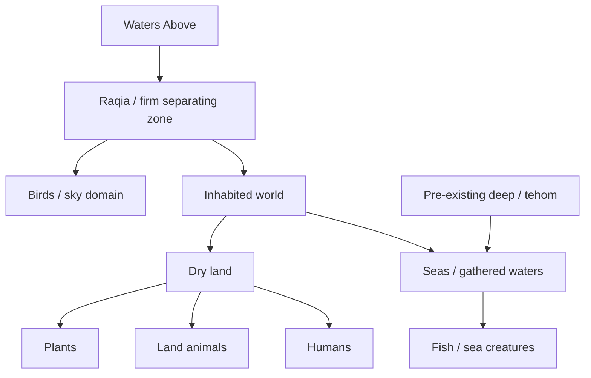
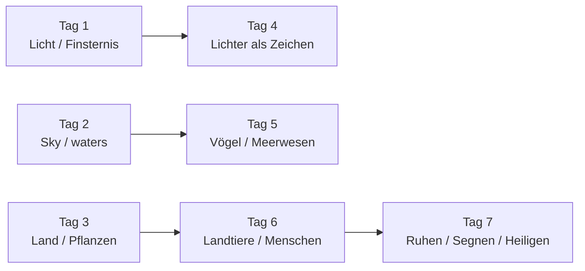

# Ausbau der TT-Companion-Dateien zu Genesis 1–6

## Executive Summary

Die bestehenden TT-Regeln und die bereits vorliegenden Companion-Dateien setzen den Rahmen bereits klar: Kontextmaterial gehört **nicht** in die Übersetzungszeile, sondern in **Tier 3 / Companion**, mit sichtbarem Disclaimer, Labels und nachvollziehbarer Quellenbasis. Genau darin liegt die Stärke des Projekts: Der Companion darf vertiefen, aber nicht umdefinieren, harmonisieren oder modernisieren. fileciteturn0file37 fileciteturn0file36

Für einen Ausbau der Companion-Dateien sind die **sichersten und zugleich ertragreichsten** Themen nicht „mehr Wissenschaft“ im allgemeinen Sinn, sondern **sauber kontrollierte Themenpakete**: **Textkritik**, **Linguistik/Korpusarbeit**, **ANE-Kosmologie**, **Archäochemie/Materialkultur**, **Landwirtschaft/Ökologie**, **Urbanisierung/Berufe**, **Metrologie/Geometrie**, **Genealogie/Chronologie**, **Hydrologie/Flussgeographie**, **Rezeptionsgeschichte** und **diagrammatische Hilfen**. Für fast alle dieser Felder gibt es heute belastbare, offen zugängliche oder institutionell abgesicherte Quellen bei der entity["organization","Israel Antiquities Authority","israel heritage agency"], der entity["organization","Vrije Universiteit Amsterdam","amsterdam university"], der University of Oxford, dem entity["organization","British Museum","london museum"], dem entity["organization","The Metropolitan Museum of Art","new york museum"], dem entity["organization","Penn Museum","philadelphia museum"], der entity["organization","UNESCO","un cultural agency"], der entity["organization","FAO","un food agency"] und der entity["organization","Deutsche Bibelgesellschaft","stuttgart publisher"]. citeturn17view2turn17view10turn17view0turn17view4turn17view3turn17view11turn17view7turn24search0

Die **beste Pilot-Reihenfolge** ist:  
erst **textnahe Module** (Textkritik, Linguistik), dann **textstützende Kontexte** (ANE-Kosmologie, Materialkultur, Landwirtschaft/Ökologie), danach **strukturierende Hilfen** (Diagramme, Karten, Zeugen-Synopsen), und **erst zuletzt** die **Rezeptionsgeschichte**. Der Grund ist einfach: Je näher ein Thema am hebräischen Text und an überprüfbaren Artefakten/Zeugen bleibt, desto höher der Leserwert und desto geringer das Risiko von Konkordismus, „smuggling“, Überdeutung oder trilingualer Drift. fileciteturn0file37 citeturn18view5turn17view2turn17view0turn17view3

**Nicht** zu pilotieren sind dagegen: Big-Bang-/Astrophysik-Korrespondenzen, Flutgeologie, Pangäa-Analogien, „Noahs Arche war seetüchtig bewiesen“, genetische Rekonstruktionen von Adam/Noah oder andere moderne Wissenschaftsmodelle, die sich als implizite Auslegung ausgeben. Solche Inhalte verletzen nicht automatisch Rule 29, aber sie kippen extrem leicht in Konkordismus oder Spekulation und sollten – wenn überhaupt – nur als explizit markierte Randnotiz mit sehr niedrigem Prioritätswert erscheinen. fileciteturn0file37

## Ausgangslage und Regelgrenzen

Der Companion sollte als **separater Studienraum** verstanden werden, der die Übersetzung transparent **begleitet**, aber nie **steuert**. In den vorhandenen TT-Dateien ist diese Logik bereits sichtbar: Companion-Material wird als eigenständiger, klar gelabelter Kontextblock mit Warnhinweis geführt; die Hauptübersetzung bleibt davon getrennt. fileciteturn0file37 fileciteturn0file36

Für den Ausbau sind daher diese Grenzen **nicht verhandelbar**:

| Grenze | Praktische Bedeutung |
|---|---|
| Tier‑3 only | Kein neues Wissenschafts-, ANE- oder Rezeptionsmaterial in Tier 1; Tier 2 höchstens minimale Verweisnotiz |
| Doppelmarkierung | Jeder Eintrag braucht **Typ + Gewissheit**, z. B. `[TEXTUAL — VERIFIZIERT]` oder `[COMPARATIVE PARALLEL — WAHRSCHEINLICH]` |
| Provenienzpflicht | Jede Behauptung braucht Quellen, Bearbeiter, Datum, Status und Review-Feld |
| Anti-Konkordismus | Nie „Genesis wusste bereits …“; nur „der Text beschreibt … / moderne Forschung beobachtet …“ |
| Kein Smuggling | Spätere Theologie, Apologetik, konfessionelle Lesarten nur als **LATER RECEPTION** |
| Trilinguale Ausrichtung | Gleiches Thema, gleiche Label-Tokens, gleiche Kernquellen, gleiche Gewissheitsstufe in EN/PT/DE |
| Keine Eingriffe in Übersetzungsdateien | Neue Arbeitsergebnisse bleiben Companion/Context; die TT-Hauptdateien werden dadurch nicht verändert |

Empfehlenswert ist ein **kanonischer Metadatenstandard**: Die **Label-Tokens** bleiben projektweit gleich (`TEXTUAL`, `COMPARATIVE PARALLEL`, `LATER RECEPTION` usw.), während **Anzeigetext und Erläuterung** deutsch, englisch oder portugiesisch lokalisiert werden dürfen. Das reduziert Trilingual-Drift erheblich.

**Teamgröße, Budget und Review-Kapazität sind nicht spezifiziert.** Die Aufwandsschätzungen unten sind daher **relative Redaktionsaufwände**:  
**S** = klein, **M** = mittel, **L** = groß.

## Kandidatenthemen

Die folgende erste Matrix vergleicht **zwölf** sinnvolle Companion-Themen nach Priorität, Aufwand, Risiko und erwartetem Leserwert.

| Thema | Priorität | Aufwand | Risiko | Leserwert | Hauptanker in Gen 1–6 |
|---|---|---:|---:|---:|---|
| Textkritik & Zeugen | Sehr hoch | M | Niedrig–Mittel | Sehr hoch | Gen 2:2; 4:8; 5; 6 |
| Linguistik & Diskursmuster | Sehr hoch | M | Niedrig | Sehr hoch | Gen 1–6 |
| ANE-Kosmologie | Hoch | M | Mittel–Hoch | Sehr hoch | Gen 1; 6 |
| Hydrologie & Flussgeographie | Hoch | M | Mittel | Hoch | Gen 2; 6 |
| Landwirtschaft | Hoch | M | Mittel | Hoch | Gen 1–4 |
| Ökologie & Tiermanagement | Hoch | M | Mittel | Hoch | Gen 1; 2; 4; 6 |
| Archäochemie & Materialkultur | Hoch | M | Mittel | Sehr hoch | Gen 4; 6 |
| Urbanisierung & Berufe | Mittel–Hoch | M | Mittel | Hoch | Gen 4 |
| Metrologie & Geometrie | Mittel | S–M | Mittel | Mittel–Hoch | Gen 2; 6 |
| Genealogie, Chronologie & Onomastik | Mittel | M | Mittel | Mittel–Hoch | Gen 4–6 |
| Rezeptionsgeschichte | Mittel–Niedrig | L | Hoch | Mittel | Gen 1–6 |
| Diagrammatische Hilfen | Sehr hoch | S–M | Niedrig–Mittel | Sehr hoch | Gen 1–6 |

Die zweite Matrix zeigt, **was** pro Thema legitim ergänzt werden kann, **wie es zu labeln ist**, **welche Quellen** passen, **welche Visualisierung** sinnvoll wäre und **welche Risiken** aktiv abgefangen werden müssen.

| Thema | Kurzbeschreibung und Relevanz | Empfohlene Labels und Vertrauen | Autoritative Quellen | Sinnvolle Visuals | Hauptrisiko | Empfohlene Minderung |
|---|---|---|---|---|---|---|
| **Textkritik & Zeugen** | Variantenapparat für Gen 2:2, 4:8, Zahlentraditionen in Gen 5, Übergänge in Gen 6; stärkt TTs „least dishonest“-Profil direkt | `[TEXTUAL — VERIFIZIERT]`; bei Rekonstruktionsvorschlägen `[THEORY/MODEL — MÖGLICH]`; Vertrauen: **hoch** | Leon-Leyvy-DSS-Digitalbibliothek; **BHQ Genesis**; **BHS**; **NETS Genesis**. citeturn17view2turn18view7turn24search0turn24search3turn24search10 | Zeugen-Synopse, Mini-Apparat, Fragmentfoto, Entscheidungsmatrix | Apparatschwemme; Leser nehmen Varianten als eigentlichen TT-Text wahr | Immer: „Basistext = TT-Haupttext / Varianten nur dokumentiert“; jede Variante mit **Auswirkungssatz** |
| **Linguistik & Diskursmuster** | Root-Tracking, Wortspiele, Formeln, Namensmuster, divine-name shifts, Wiederholungscluster; sehr hoher Nutzen für Gen 1–6 | `[TEXTUAL — VERIFIZIERT]`; bei literarischer Funktion `[STRONG INFERENCE — WAHRSCHEINLICH]`; Vertrauen: **hoch/mittel** | ETCBC; VU-Artikel zur ETCBC-Datenbank; SHEBANQ. citeturn17view10turn18view5turn9search8turn9search13 | Root-Map, Netzdiagramm, Formel-Heatmap | Falsche Präzision durch Zählwerte; moderne Kategorien werden über den Text gestülpt | Zuerst **Form**, dann **Funktion**; Zählung nie als Interpretation ausgeben |
| **ANE-Kosmologie** | Kosmische Gewässer, `tehom`, `raqia`, obere/untere Wasser, Welt als geordneter Raum; besonders relevant für Gen 1 und Flutvorgeschichte | `[TEXTUAL — VERIFIZIERT]` + `[COMPARATIVE PARALLEL — WAHRSCHEINLICH]`; bei Rekonstruktionen `[THEORY/MODEL — MÖGLICH]`; Vertrauen: **hoch/mittel** | Babylonische Weltkarte im British Museum; Enūma-elish-Tafeln im British Museum; Oracc-Material zu Marduk/Tiamat; deutschsprachige Forschung über religionsgeschichtliche Methode. citeturn17view0turn15search5turn15search3turn15search0turn4search0 | Schichtschema des Kosmos, Objektfoto der Weltkarte, Vergleichstafel „Text / Modell / Grenze“ | Konkordismus; Totalisierung „der ANE dachte so“; Abhängigkeit wird überbehauptet | Immer formulieren: „ähnliches Motiv“, „plausibler Hintergrund“, **nie** „Genesis kopiert / bestätigt moderne Kosmologie“ |
| **Hydrologie & Flussgeographie** | Eden-Flüsse, Marsch-/Delta-Kontext, Gewässergrenzen, Flut als Auflösung geordneter Räume; stark für Gen 2 und 6 | `[TEXTUAL — VERIFIZIERT]`; `[HISTORICAL/ARCHAEOLOGICAL — WAHRSCHEINLICH]`; `[COMPARATIVE PARALLEL — MÖGLICH]`; Vertrauen: **mittel/hoch** | UNESCO Ahwar; ODB/Ortsangaben zu Eden/Pischon/Gihon; Babylonische Weltkarte. citeturn17view11turn27view2turn19view3turn17view0 | Unsicherheitskarte, Flussdiagramm, Marsch-zu-Stadt-Visualisierung | Überpräzise Lokalisierung von Eden; moderne Kartographie ersetzt Textoffenheit | Karten immer mit **Unsicherheitszonen**; Pischon/Gihon nur als offene Feldmarkierung |
| **Landwirtschaft** | Saatgut, Fruchtbäume, Gartenpflege, Ackerbau bei Kain, altorientalische Feldarbeit; sehr relevant für Gen 1–4 | `[TEXTUAL — VERIFIZIERT]`; `[HISTORICAL/ARCHAEOLOGICAL — WAHRSCHEINLICH]`; Vertrauen: **mittel/hoch** | ETCSL „Farmer’s Instructions“; Penn „Sumerian Harvest Time“; Scientific Reports zu Domestikationspfaden; FAO zum Fruchtbaren Halbmond. citeturn25search0turn25search2turn18view4turn18view1turn17view7 | Agrarkalender, Seeder-plough-Skizze, „seed-bearing“/„fruit-bearing“-Schema | Spätere mesopotamische Agrarpraxis wird direkt in Genesis eingelesen | Immer als **vergleichender Rahmen**, nie als direkter historischer Sitz im Leben eines einzelnen Verses |
| **Ökologie & Tiermanagement** | Ursprüngliche Pflanzennahrung, Tierkategorien, Herdenkontext, „all flesh“, frühe Domestikation im weiteren SW-Asien; relevant für Gen 1, 2, 4, 6 | `[TEXTUAL — VERIFIZIERT]`; `[HISTORICAL/ARCHAEOLOGICAL — WAHRSCHEINLICH]`; `[SCIENTIFIC COMPARISON — MÖGLICH]`; Vertrauen: **mittel/hoch** | Met-Chronologie Mesopotamien; Scientific Reports zur Tiernutzung im südlichen Levante-Raum; Studien zur saisonalen Reproduktion domestizierter Rinder als Kontext für Herdensysteme. citeturn22view4turn17view9turn18view3turn19view2 | Tierkategorien-Rad, Hirte/Ackerbauer-Matrix, Nahrungsvorgaben-Tabelle | Moderne Umweltethik oder Veganismus werden in Gen 1 hineingetragen | Klare Trennung: **Textideal**, **archäologischer Kontext**, **moderne Debatte** |
| **Archäochemie & Materialkultur** | Als legitime Form von „Chemie“: Bitumen, `kopher`, Kleb-/Dichtstoffe, Gussverfahren, Instrumente, Werkzeug, Holz/Material-Unsicherheit; hoch relevant für Gen 4 und 6 | `[TEXTUAL — VERIFIZIERT]`; `[HISTORICAL/ARCHAEOLOGICAL — WAHRSCHEINLICH]`; `[SPECULATION/CURIOSITY — SPEKULATIV]` nur für konkrete Rekonstruktionen; Vertrauen: **mittel/hoch** | Penn-Bitumenboot; Met-Sichelklinge in Bitumen; Penn-Reed-Boat-Experiment; Met/BM-Lyren; Heritage-Science-Beiträge zu Bitumenhandel und Metallguss; Vorderasiatisches Museum. citeturn17view3turn17view4turn22view5turn22view1turn17view6turn18view9turn22view2turn22view6 | Objektgalerie, Materialtabelle, Bootquerschnitt, Gussprozess-Schema | „Noahs Arche sah genauso aus“; Pseudohistorie; Apologetik | Nur **Objektfamilien und Verfahren** zeigen; keine singuläre Arche-Rekonstruktion als Fakt |
| **Urbanisierung & Berufe** | Kains Stadt, Jabal/Jubal/Tubal-Kain als Berufs-/Technikcluster, frühe Stadt- und Handwerkskontexte; stark für Gen 4 | `[TEXTUAL — VERIFIZIERT]`; `[HISTORICAL/ARCHAEOLOGICAL — WAHRSCHEINLICH]`; Vertrauen: **mittel/hoch** | Met „Uruk: The First City“; UNESCO Ahwar-Entscheidung; Penn „Mesopotamian City Life“. citeturn27view1turn27view2turn27view0 | Berufsnetzwerk, Stadt-/Marsh-Timeline, Proto-Urbanisierungskarte | Etiologische Erzählung wird als lineare Technikgeschichte gelesen | Deutlich sagen: Genesis **inszeniert Ursprungsnarrative**, sie führt keine moderne Innovationsgeschichte |
| **Metrologie & Geometrie** | Ellenmaß, Proportionen der Arche, räumliche Beziehungen der Flüsse, Größenverhältnisse; nützlich, wenn streng didaktisch gehalten | `[TEXTUAL — VERIFIZIERT]`; `[THEORY/MODEL — MÖGLICH]`; Vertrauen: **mittel** | Met-Ellenstab; BM-Cubit-Rod + Bildlizenz; ODB zu Eden-Geographie. citeturn17view5turn18view8turn19view3 | Proportionsdiagramm, Seiten-/Draufsicht, Maßstabsbalken | Ark-Engineering-Apologetik; falsche Exaktheit bei nicht festem Ellenmaß | Immer: „didaktische Visualisierung“, „nicht maßstabsgetreu“, „keine Seetüchtigkeitsbehauptung“ |
| **Genealogie, Chronologie & Onomastik** | `toledot`, Alterszahlen, Formelserien, Namenswortspiele, Gen‑5-Anomalien, Vergleich mit Herrscherlisten | `[TEXTUAL — VERIFIZIERT]`; `[COMPARATIVE PARALLEL — WAHRSCHEINLICH/MÖGLICH]`; Vertrauen: **mittel** | ETCSL Sumerische Königsliste; deutsche Gen-4/Urgeschichte-Artikulation bei WiBiLex. citeturn17view1turn17view13 | Genealogie-Baum, Altersbalken, Formeldichte-Karte | Absolute Chronologien; biologisch-naturwissenschaftliche Spekulation zu Lebensalter | Chronologie als **literarisch-komparativer Datensatz**, nicht als naturwissenschaftliches Modell |
| **Rezeptionsgeschichte** | Frühjüdische, rabbinische, patristische, später ggf. islamische und literarische Lesarten; hoher Wert, aber nachrangig | `[LATER RECEPTION — VERIFIZIERT]`; Vertrauen: **hoch** für Quellen, **mittel** für Relevanzgewichtung | Philo *De Opificio Mundi*; *Bereshit Rabbah*; Augustinus *De civitate Dei*. citeturn17view12turn11search5turn11search6 | Rezeptionszeitleiste, Traditionsbaum | Smuggling später Theologie in den hebräischen Text | Immer am Ende des Companions; explizit: „spätere Lesart, nicht Ausgangsbedeutung“ |
| **Diagrammatische Hilfen** | Karten, Zeugen-Synopsen, Objektplatten, mermaid-Schemata, Formeltabellen; extrem nützlich, wenn sie **nicht dekorativ**, sondern beweisgeführt sind | Das Diagramm übernimmt die Labels der zugrundeliegenden Claims; Vertrauen: **abhängig vom Inhalt** | BM-Bildrechte; Met Public-Domain-Objekte; DSS-Spektralbilder; UNESCO-Karten. citeturn18view8turn17view4turn18view7turn12search17 | Mermaid-Flows, Zeitachsen, Unsicherheitskarten, Objekttafeln | Diagramme erzeugen falsche Autorität | Jede Abbildung braucht Caption mit **Label, Gewissheit, Quelle, Maßstabsvermerk** |

## Risiko- und Compliance-Protokoll

Die größten Risiken liegen **nicht** darin, dass Companion-Material „zu interessant“ wird, sondern darin, dass es **epistemisch unklar** oder **rhetorisch zu stark** formuliert wird. Die vier Hauptfehler sind: **Konkordismus**, **smuggling später Theologie**, **Überbehauptung** und **trilinguale Drift**. Die Gegenmittel sind mechanisch und sollten redaktionell verpflichtend sein. fileciteturn0file37

| Fehlerachse | Rotes Signal | Sichere Formulierung |
|---|---|---|
| Konkordismus | „Genesis beschreibt den modernen Wasserkreislauf / die Atmosphäre / Geologie.“ | „Der Text beschreibt geordnete Räume und Gewässer; moderne Naturwissenschaft beschreibt andere Dinge mit anderer Zielsetzung.“ |
| Smuggling | „Hier ist bereits die spätere Lehre X gemeint.“ | „Spätere Ausleger lasen X hier hinein / aus diesem Vers heraus.“ |
| Überbehauptung | „Dieser ANE-Text beweist direkte Abhängigkeit.“ | „Dieser Text zeigt ein motivisches Parallelstück; Abhängigkeit bleibt offen.“ |
| Trilinguale Drift | EN/PT/DE ziehen unterschiedliche Schlussstufen | Ein **gemeinsamer Metadatensatz** steuert Labels, Gewissheit, Quellen und Kurzzusammenfassung |
| Falsche Präzision | „Die Arche war genau … Meter lang und damit …“ | „Je nach angenommener Elle ergibt sich ungefähr …; die Visualisierung ist didaktisch.“ |
| Diagrammautorität | „Die Grafik zeigt, wie es war.“ | „Schematische Rekonstruktion; nicht maßstabsgetreu; ein Modell unter mehreren.“ |

Zusätzlich empfehlenswert sind **verpflichtende Formulierungsschablonen**:

| Zweck | Verwenden | Vermeiden |
|---|---|---|
| Textbeobachtung | „Der hebräische Wortlaut setzt voraus …“ | „Genesis beweist …“ |
| Vergleich ANE | „Ein altorientalisches Zeugnis zeigt ein ähnliches Motiv …“ | „Die Bibel übernimmt hier …“ |
| Wissenschaftsvergleich | „Moderne Forschung beobachtet …; der Text behauptet das nicht.“ | „Der Autor wusste bereits …“ |
| Modell | „Ein gebräuchliches Rekonstruktionsmodell stellt …“ | „So dachte der antike Autor sicher …“ |
| Rezeption | „Spätere jüdische/christliche Leser deuteten …“ | „Der ursprüngliche Sinn ist bereits …“ |

Ein zusätzlicher, sehr nützlicher Governance-Schritt wäre: **Mischthemen nie als Ein-Etikett-Sektion publizieren**. Wenn ein Modul z. B. `raqia` behandelt und zugleich hebräische Wortbeobachtung, altorientalische Parallelen und moderne Wissenschaftskontraste enthält, dann sollen die **einzelnen Unterabsätze** jeweils ihr eigenes Label tragen, statt die gesamte Sektion pauschal z. B. als „Textual Verified“ auszugeben.

## Priorisierter Umsetzungsplan

Da Teamgröße und Budget **nicht spezifiziert** sind, ist ein **inkrementeller Rollout** sinnvoll. Empfehlenswert ist ein **deutscher Master-Entwurf**, gefolgt von **EN/PT-Kurzfassungen** mit identischer Metadatenbasis.

| Phase | Pilot | Aufwand | Kapitelanker | Mindest-Deliverables |
|---|---|---:|---|---|
| **Sofort** | **Textkritik-Grundmodul** | M | Gen 2:2; 4:8; 5 | 1 Companion-Abschnitt (DE), 1 Zeugen-Tabelle, 1 Provenienzlog-Eintrag, 3 Kurzfassungen (EN/PT/DE) |
| **Sofort** | **Linguistik-Dashboard** | M | Gen 1–6 | Root-Tracking `adam/adamah`, `arum/arom`, `teshuqah/mashal`, `nacham/Noach`; 1 Diagramm; 1 Sammel-Log-Eintrag |
| **Sofort** | **Materialkultur / Archäochemie** | M | Gen 4; 6 | Objektblock zu Bitumen, Boot, Lyre, Metall; 4–6 Caption-Karten; 1 Provenienzlog |
| **Nächste Welle** | **ANE-Kosmologie + Hydrologie** | M–L | Gen 1; 2; 6 | 1 Modellgrafik, 1 Unsicherheitskarte, Quellenpaket BM/UNESCO/ODB, trilinguale Zusammenfassung |
| **Nächste Welle** | **Landwirtschaft + Ökologie** | M | Gen 1–4 | 1 Agrarkalender, 1 Hirte/Ackerbauer-Matrix, 2 Companion-Untersektionen |
| **Danach** | **Urbanisierung + Berufe** | M | Gen 4 | 1 Stadt-/Berufsnetzwerk, 1 Kontextsektion zur frühen Urbanität |
| **Danach** | **Metrologie + Geometrie** | S–M | Gen 2; 6 | 2 schematische Visualisierungen, Maß-Hinweise, „nicht maßstabsgetreu“-Caption |
| **Später** | **Genealogie + Chronologie** | M | Gen 4–6 | 1 Linie/Timeline, 1 Vergleich zu Herrscherlisten, 1 Namenscluster |
| **Zuletzt** | **Rezeptionsgeschichte** | L | Gen 1–6 | 1 Appendix „Spätere Lesarten“, ausschließlich klar als LATER RECEPTION markiert |

**Empfohlene Pilotreihenfolge inhaltlich:**  
Textkritik → Linguistik → Materialkultur → ANE-Kosmologie/Hydrologie → Landwirtschaft/Ökologie → Urbanisierung → Metrologie → Genealogie → Rezeptionsgeschichte.

**Empfohlene Mindestanforderung pro neuem Thema:**

1. **DE-Hauptabschnitt** mit 400–900 Wörtern  
2. **Label + Gewissheit** auf Eintrags- oder Unterabschnittsebene  
3. **Mindestens zwei autoritative Quellen**, davon möglichst eine primär/offiziell  
4. **Ein Visual** (Mermaid, Tabelle, Karte, Objektplatte)  
5. **Ein Provenienzlog-Eintrag**  
6. **EN/PT/DE-Kurzsummary** mit identischen Metadaten  
7. **Konkordismus- und Smuggling-Check** vor Freigabe

## Vorlagen, Diagramme und Quellen

### Themenkopf-Vorlage

```md
### [Themenname]

**Pflicht-Disclaimer**
Diese Sektion bietet kontextuelles, vergleichendes und ggf. naturwissenschaftsbezogenes Studienmaterial.
Sie definiert die TT-Hauptübersetzung nicht neu, steuert sie nicht und ersetzt sie nicht.
Parallelen belegen nicht automatisch literarische Abhängigkeit.
Moderne Modelle beschreiben den antiken Text nicht einfach „rückwärts“.
Alle Einträge sind nach Typ, Gewissheit und Provenienz gekennzeichnet.

**Kanonischer Label-Token**
TEXTUAL / STRONG INFERENCE / COMPARATIVE PARALLEL / HISTORICAL-ARCHAEOLOGICAL /
THEORY-MODEL / SCIENTIFIC COMPARISON / LATER RECEPTION / SPECULATION

**Angezeigte Label-Zeile**
[TEXTUAL — VERIFIZIERT]

**Kapitel / Verse**
Gen X:Y–Z

**Kurzurteil**
1–2 Sätze: Was genau wird behauptet, und mit welcher Reichweite?

| Quelle | Typ | Funktion | Sprache | Zugriff | Notiz |
|---|---|---|---|---|---|
| [Titel] | Primär / Museum / Peer Review / Referenzwerk | Kernbeleg / Kontext / Kontrast | EN / DE / PT | [Link] | ... |

**Provenienz-Eintrag**
- Topic-ID:
- Datum:
- Bearbeiter:
- Kapitel/Verse:
- Claim in 1 Satz:
- Label:
- Gewissheit:
- Primärquellen:
- Sekundärquellen:
- Visual vorhanden?:
- Konkordismus-Check bestanden?:
- Smuggling-Check bestanden?:
- EN/PT/DE-Abgleich erledigt?:
- Reviewer:
- Status: Draft / Reviewed / Locked
```

### Einseitige Box „Wie man diesen Companion benutzt“

> **Wie man diesen Companion benutzt**
>
> 1. Lies zuerst den TT-Haupttext.  
> 2. Lies den Companion als **Hintergrund**, nicht als Ersatz für die Übersetzung.  
> 3. Das **erste Label** sagt, **welcher Behauptungstyp** vorliegt.  
> 4. Das **zweite Label** sagt, **wie sicher** die Behauptung ist.  
> 5. **Vergleich** bedeutet nicht automatisch **Abhängigkeit**.  
> 6. **Wissenschaftsvergleich** bedeutet nicht **Bestätigung** oder **Widerlegung** des Textes.  
> 7. **Spätere Rezeption** ist nicht die ursprüngliche hebräische Ausgangsbedeutung.  
> 8. Wo Unsicherheit besteht, hat die TT-Hauptübersetzung Vorrang.  
> 9. Diagramme sind **schematisch** und oft **nicht maßstabsgetreu**.  
> 10. Wenn ein Thema trilingual erscheint, müssen Labels, Gewissheit und Quellen identisch bleiben.

### Contributor-Style-Guide für wissenschaftsnahe Themen

```md
DO
- Beginne immer mit dem hebräischen Wortlaut oder der direkten Textbeobachtung.
- Verwende möglichst offizielle oder peer-reviewte Quellen.
- Trenne Daten, Modell und Interpretation sichtbar.
- Markiere jeden Claim mit Typ + Gewissheit.
- Formuliere zurückhaltend: "beschreibt", "legt nahe", "zeigt eine Parallele".
- Füge eine EN/PT/DE-Kurzfassung mit denselben Metadaten hinzu.
- Gib jeder Grafik eine Caption mit Quelle, Label und "schematisch/nicht maßstabsgetreu", falls nötig.

DON'T
- Sage nie: "Genesis wusste bereits ..."
- Behaupte nie direkte Abhängigkeit ohne starke Belege.
- Benutze keine naturwissenschaftlichen Modelle als versteckte Auslegung.
- Importiere keine spätere konfessionelle Deutung in eine Textnotiz.
- Rekonstruiere keine Objekte oder Weltbilder mit falscher Exaktheit.
- Überlade Tier 2 oder die Hauptübersetzungsdatei.
- Nutze keine AI-Bilder als Belegmaterial ohne ausdrückliche Kennzeichnung und Quellenprüfung.
```

### Mermaid-Diagramme für Companion-Erweiterungen

Die Diagramme unten sind als **interne Standardschemata** gedacht. Sie sollten jeweils mit Label, Gewissheit und Quellen-Caption veröffentlicht werden.

**ANE-Kosmologiemodell** – nützlich für Gen 1 und als Rückverweis in Gen 6. Das Schema stützt sich auf textliche Beobachtungen zum Gewässerrahmen und auf mesopotamische Vergleichsobjekte wie die babylonische Weltkarte. citeturn17view0turn15search5



**Genesis‑1‑Funktionsordnung** – nicht als naturwissenschaftliche Chronologie, sondern als Ordnungs-/Zuordnungsdiagramm. fileciteturn0file36



**Editorial Workflow für neue Companion-Themen** – dieser Ablauf schützt die Hauptübersetzung und erzwingt Nachvollziehbarkeit.


### Autoritative Kernquellen und Bildempfehlungen

Die belastbarsten Startquellen für das Projekt sind:

| Bereich | Bevorzugte Quellen | Bemerkung |
|---|---|---|
| **Manuskripte & Textkritik** | DSS Digital Library; BHQ Genesis; BHS; NETS Genesis; HBCE. citeturn17view2turn18view7turn24search0turn24search3turn24search10turn24search7 | Höchster Wert für genaue Variantendokumentation |
| **Hebräische Korpusarbeit** | ETCBC; SHEBANQ; VU-Artikel zur Datenbank. citeturn17view10turn18view5turn9search8 | Ideal für Wortfeld-, Formel- und Diskursanalysen |
| **ANE-Primärtexte** | ETCSL (Königsliste, Farmer’s Instructions); British-Museum-Objekte zu *Enūma eliš*. citeturn17view1turn25search0turn25search8turn15search5turn15search3 | Vergleichsmaterial nur als Vergleich, nicht als Steuermodell |
| **Museen / Materialkultur** | British Museum; Met; Penn Museum; Vorderasiatisches Museum. citeturn17view0turn17view4turn17view3turn22view6 | Sehr gut für Objekte, Legenden, Maße, Bilder |
| **Geo-/Ökokontext** | UNESCO Ahwar; FAO Near East/Fertile Crescent; ODB Eden/Ortsangaben. citeturn27view2turn17view7turn19view3 | Besonders sinnvoll für Gen 2 und Gen 4–6 |
| **Deutschsprachige Exegese/Bibelkunde** | WiBiLex / Die-Bibel.de; ODB-Ortsangaben. citeturn17view13turn19view2turn19view3 | Gute DE-Stütze für Trilingualität |
| **Portugiesische Ergänzungsliteratur** | *Criação, Meio Ambiente e Ecologia no Antigo Testamento*; *Criação e Cuidado*; ökologische Gen‑1-Lesungen; neuere PT-Arbeiten zu Kain/Abel und ANE-Mythen. citeturn23search5turn23search15turn23search1turn23search2turn23search7 | Nur **ergänzend**, nie steuernd gegenüber Text und Primärquellen |

Für Abbildungen sollte der Standard lauten: **erst interne Schemata**, dann **lizenzsichere externe Bilder**. Geeignete Starter:

| Bild-/Objekttyp | Empfohlene Quelle | Einsatz | Rechtehinweis |
|---|---|---|---|
| Babylonische Weltkarte | British Museum | ANE-Kosmologie, Weltbildmodell | Lizenz-/Nutzungscheck je Objektseite nötig; Institution sehr gut dokumentiert. citeturn17view0 |
| Cubit-Rod-Bild | British Museum Bild 13537001 | Metrologie/Geometrie | Bild ist für nichtkommerzielle Nutzung unter **CC BY-NC-SA 4.0** freigegeben. citeturn18view8 |
| Bitumen-Sichelklinge | Met | Landwirtschaft / Archäochemie | Objektseite als **Public Domain** ausgewiesen. citeturn17view4 |
| Bitumenboot aus Ur | Penn Museum | `kopher`, Bootstechnik, Materialkultur | Rechte/Permissions über Penn Collections klären. citeturn17view3 |
| DSS-Spektralbild | IAA / Leon Levy DSS Library | Textkritik, Manuskripte | Offizielle Projektplattform mit hochauflösenden multispektralen Bildern. citeturn18view7turn17view2 |
| Uruk-/Proto-Schrift-Objekte | Met | Urbanisierung, Verwaltung, Frühschrift | Met-Seiten sind institutionell stabil; viele mit frei nutzbaren Abbildungen. citeturn27view1 |

Wichtig für die trilinguale Praxis: Mehrere Kernquellen unterstützen bereits **deutsche** oder **portugiesische** Interfaces, darunter die DSS-Seiten in deutscher Lokalisierung und Met-Objektseiten mit deutsch/portugiesischer Navigation. Das erleichtert EN/PT/DE-Kurzfassungen erheblich. citeturn18view7turn17view4turn27view1